# 常见音频芯片

其他很多智能音箱用的很多`ADC`等音频芯片，也是TI的。现在去整理相关信息。

## 常见智能音箱类所用音频类芯片

| 智能音箱类产品 | 产品外形图 | 音频和主控芯片拆解图 | 音频和主控芯片 |
| ------------ | -------- | ---------------- | ----------- |
| 亚马逊 Echo Show智能音箱 | 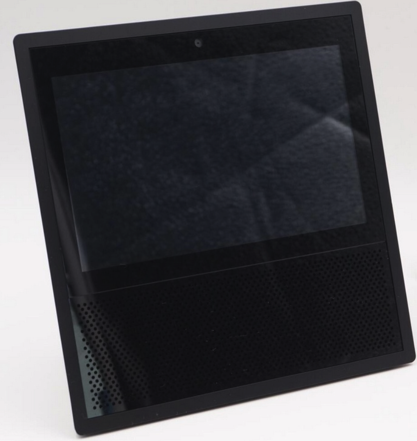 |  | `TI ADC3101` x 4  ADC 3101 TI 751 AZL9 |
| 天猫精灵魔盒 | 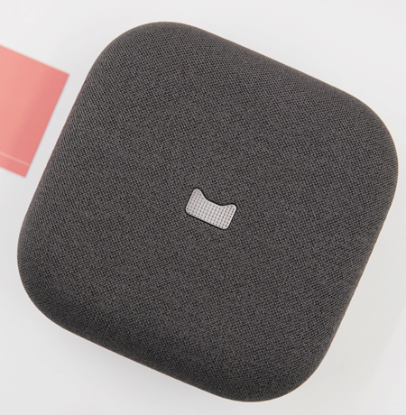 | 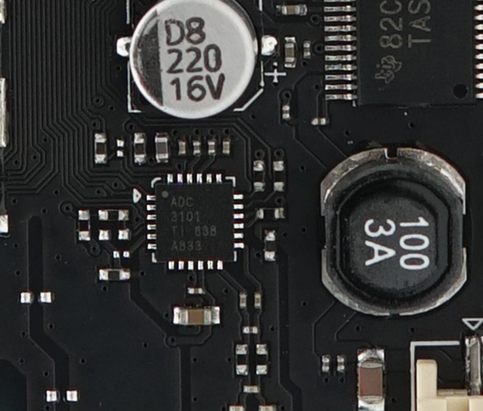 | `TI ADC3101` x 2  ADC 3101 TI 838 A833 |
| | | 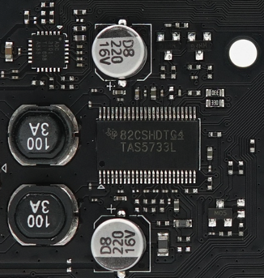 | TI德州仪器 TAS5733L |
| 天猫精灵方糖智能音箱 | 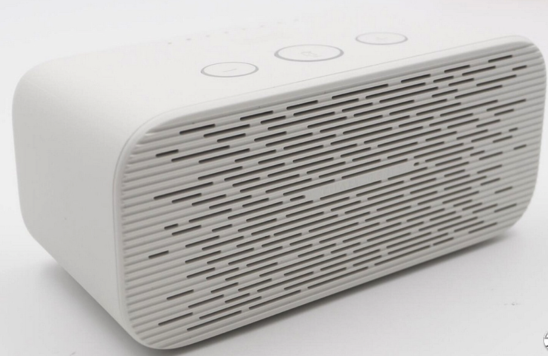 | 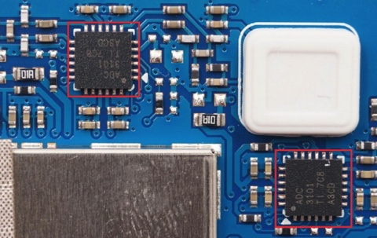 | `TI ADC3101` x 2  ADC 3101 TI 7C8 A3CD |
| 天猫精灵TG_X1智能音箱 | 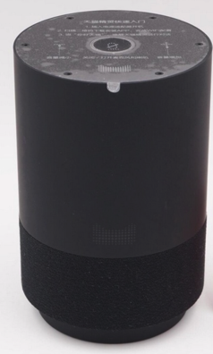 | 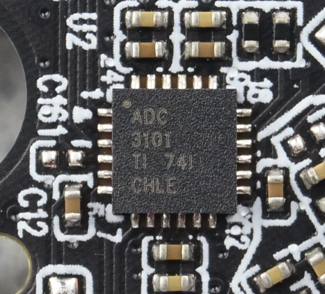 | `TI ADC3101` x 1 ?  ADC 3101 TI 741 CHLE |
|   |  | 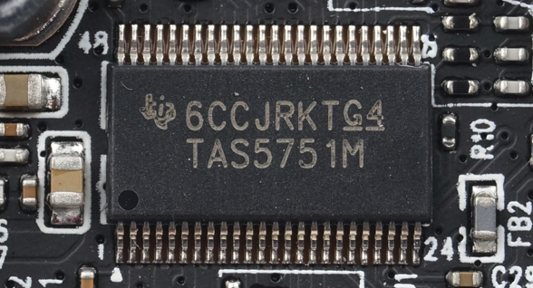 | `TI TAS5751M`  6CCJKRTG4 TAS5751M |
| 天猫精灵M1智能音箱 | 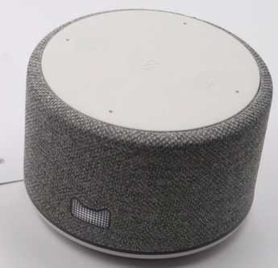 | 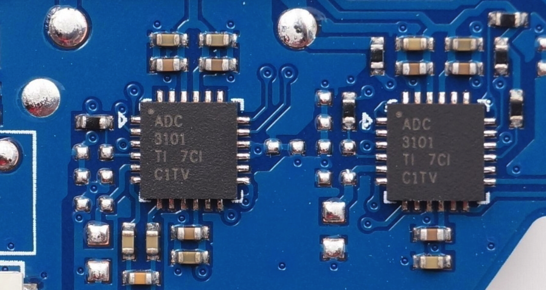 | `TI ADC3101` x 2  ADC 3101 TI 7CI C1TV |
| | | 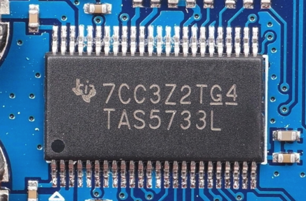 | `TI TAS5733L`  7CC3Z2TG4 TAS5733L |
| 腾讯听听智能音箱 | 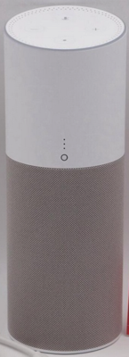 | 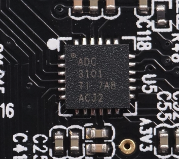 | `TI ADC3101` |
| 小度在家智能视频音箱 | 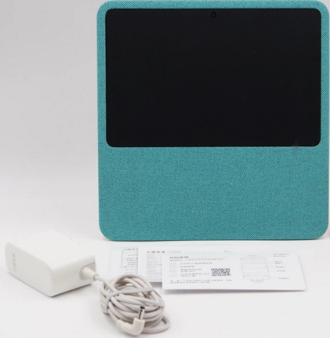 | 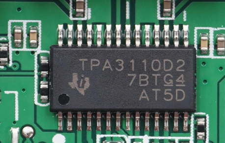 | `TPA3110D2`   TPA3110D2 7BTG4 AT5D |
| 小米小爱AI音箱 | 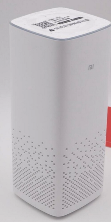 | 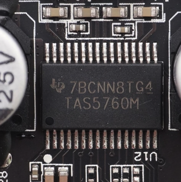 | `TI TAS5760M`   7BCNN8TG4 TAS5760M |

## 音频芯片介绍

| 芯片名 | 厂家 | 功能介绍 | 备注说明 |
| ----- | --- | ------ | ------- |
| ADC3101 ADC | TI德州仪器 | <ul><li>支持立体声输入</li><li>支持miniDSP</li><li>信噪比达到92dB</li><li>低功耗</li></ul> | 处理麦克风收集到的音频信号 |
| TAS5733L 数字音频功率放大器 | TI德州仪器 | <ul><li>单立体声串行音频输入</li><li>支持I2S输入</li><li>支持44.1kHz和48kHz采样速率</li><li>104-dB 信噪比 (SNR)</li><li>内建耳放</li><li>输出功率10W</li></ul> | 多用于智能电视等设备 |
|  TAS5751M 数字音频功率放大器 | TI德州仪器 | <ul><li>内置均衡器</li><li>3段自动增益限制</li></ul> | |
|  TPA3110D2 数字功放 | TI德州仪器 | <ul><li>单路输出最大15W</li><li>供电电压8-26V</li></ul> | |
| TAS5760M | TI德州仪器 | <ul><li>单路立体声输入</li><li>可选软件或硬件控制</li><li>集成数字消波器</li><li>多种增益选择</li><li>支持宽电压输入</li></ul> | 适合多种场合 |
