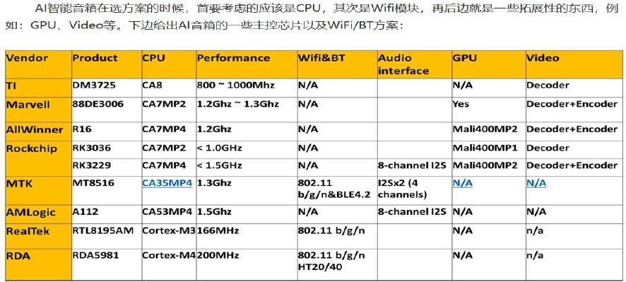
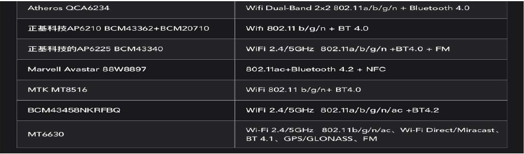
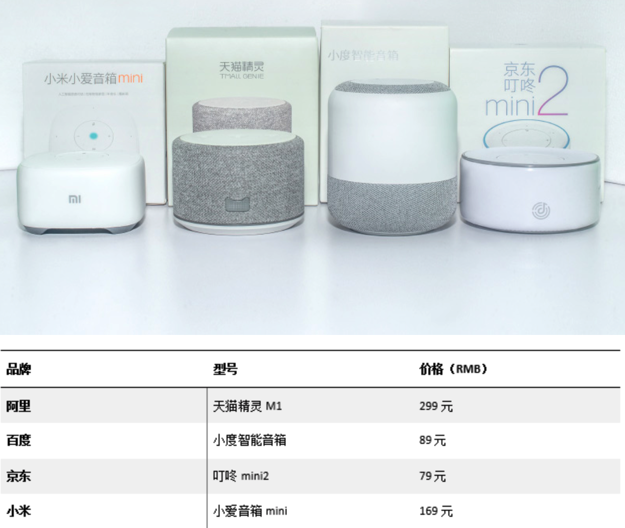
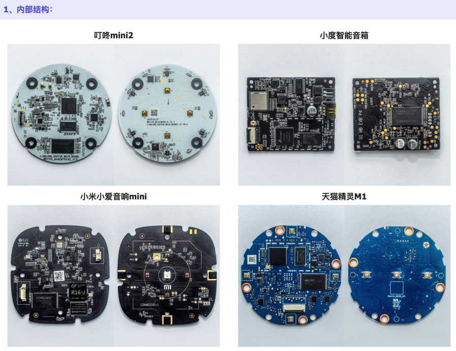
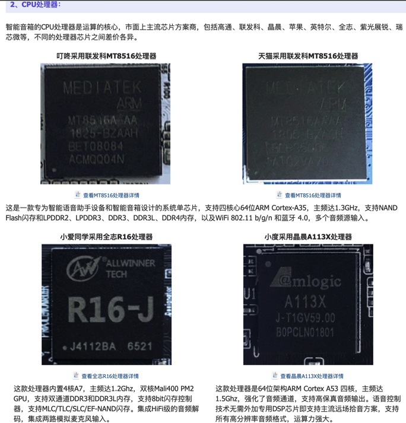
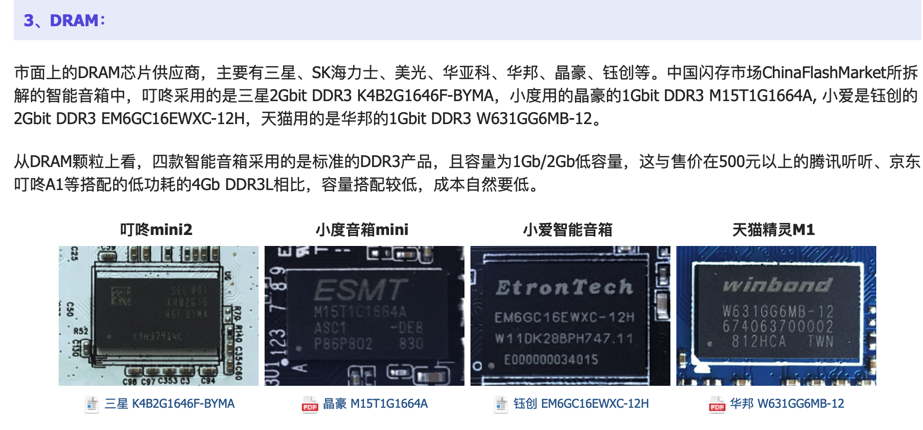
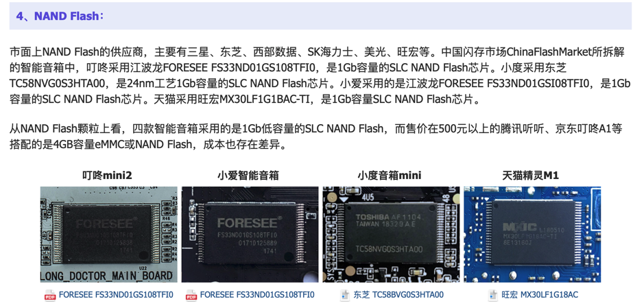
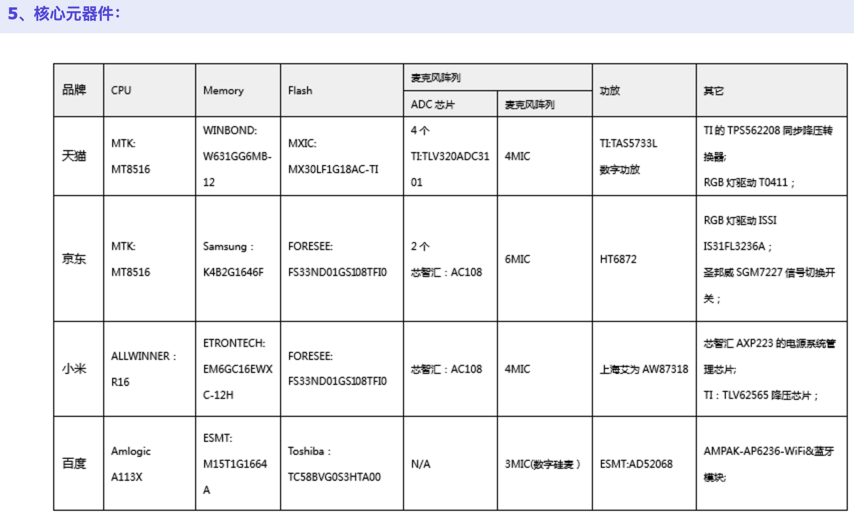
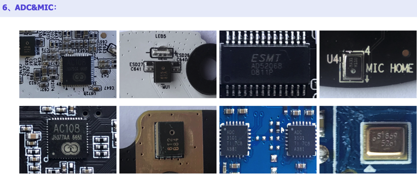

# 常见智能音箱方案

下面整理一些常见的智能音箱的芯片选型和典型方案：

## 音频芯片

通过[音频芯片](http://book.crifan.com/books/smart_speaker_disassemble_summary/website/common_smart_speaker/audio_chip.html)，我们可以得出[这里](http://www.52audio.com/archives/6698.html)的总结

> 以上几项拆解可以看出，作为智能音箱里面的一个很重要的组成部分，模拟音频方面的芯片在智能音箱的整个语音识别和回放功能上举足轻重，几乎知名的智能音箱产品都使用了TI德州仪器的芯片，以保证用户在使用智能音箱时能得到准确地反馈。

即：很多中高端的智能音箱，音频方面的芯片，都是采用了`TI 德州仪器`的音频相关芯片。

## 智能音箱方案选型考虑因素 + 主流音箱对比

### 硬件上成本控制

智能音箱虽然形态较小，但内部结构复杂，主要包括`CPU`处理器、`DRAM`芯片、`NAND Flash`芯片、`音频放大器`、`蓝牙`模块、`电源管理`芯片等，是影响成本的关键，也是完成智能交互、智能控制、音频播放等操作的重要电子元件。

### 内部结构

### CPU

### DRAM

### NAND Flash

### 核心原器件

### ADC & MIC

