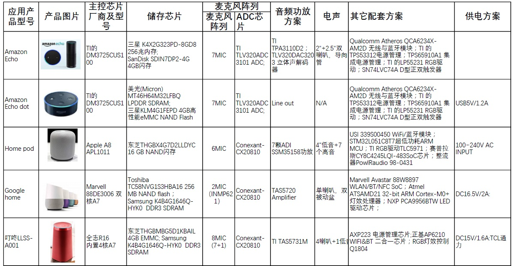
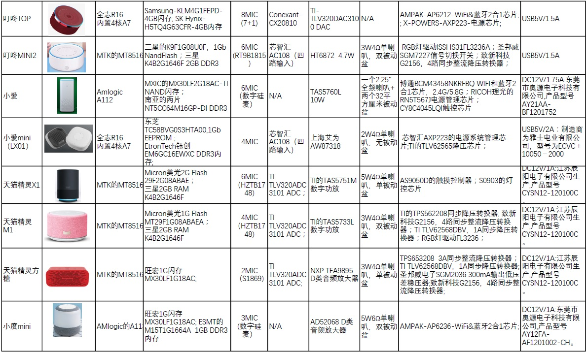
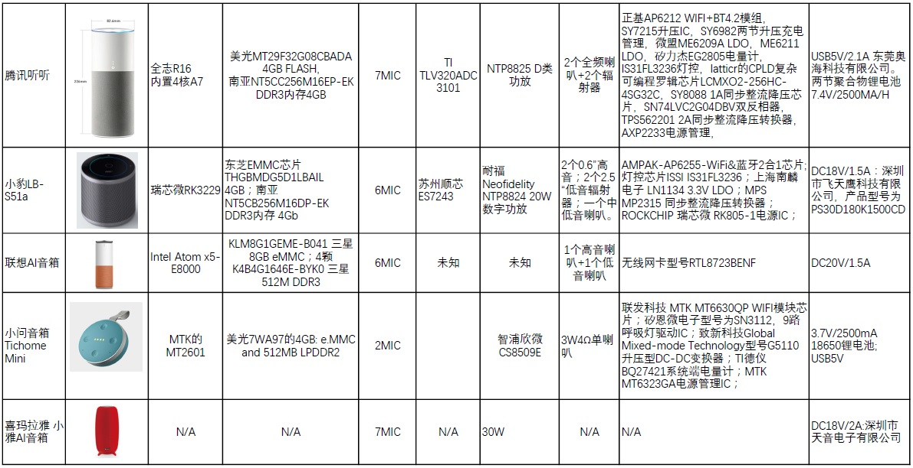
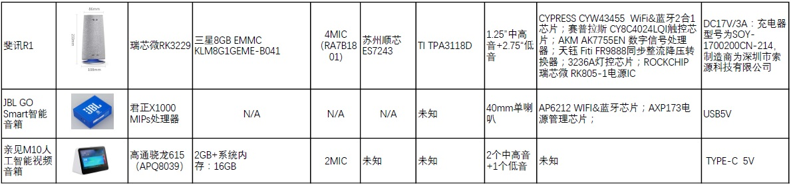

# 常见音箱BOM

下面整理一些常见智能音箱的信息：

## 常见智能音箱BOM物料清单

以及另外整理的列表：

## 常见智能音箱BOM清单芯片信息及详细参数

| 组件和参数/音箱 | 腾讯叮当智能试听屏 | Echo Show | 小度在家 | 京东叮咚Play智能音箱 | 天猫精灵CC带屏智能音箱 | 小米小爱智能闹钟 |
| ------------ | -------------- | ----------- | ------ | ----------------- | ----------------| ------------------|
| **厂商** | 腾讯 | 亚马逊 | 小鱼，百度 | 灵隆科技，京东 | 阿里 | 小米 |
| **主控** | MT8167A，四核ARM Cortex-A35，1.5G,内置2.4G WiFi和蓝牙，支持HEVC，H.264和MPEG-4等格式的视频 | Intel英特尔 Atom x5-Z8350 处理器，2M 缓存, 最高1.92 GHz | 全志R58芯片，内建8核A7处理器，支持DDR2/3内存，SGX544 GPU，支持EMMC4.5，FCBGA封装，345pin，14mm² | 英特尔凌动 x5-Z8350处理器，四核1.44GHz频率，最高睿频1.92GHz，采用14nm工艺，热设计功耗2W，支持单通道DDR3L 1600MHz | MT8167A | MT8516AAAA,四核心64位ARM Cortex-A35，主频1.3GHz |
| **WiFi/BT** | 主控集成 | BROADCOM博通BCM43570KFFBG 802.11ac 千兆WiFi模块，集成蓝牙Bluetooth 4.1 和EDR | 海华无线模组 | AP6255，WIFI双频+BT4.2模块 | MT7668 | 主控集成 |
| **麦克风阵列** | MEMS贴片硅麦*6 | 双排 硅麦 *8 | 6 mic|双排 硅麦 *8 | 3 mic | 4 mic|
| **按钮** | 3| 3| 1| 4| 4| 1|
| **结构特点** | 梯形，手提凹槽，底部扬声器 | 棱角分明，前置出声|多色包布| L型，自带HDMI接口|圆润紧凑|顶部按键周围有12颗LED灯组成的光圈，8颗白色，4颗双色|
|**电源输入**|12V 2A|15V 1.4A|12V 2A|15V 2A|12V 1.5A|5V 1.5A|
| **屏幕** | 8寸 1280\*800（16:10），国产KD080D34液晶触控屏 | 7.0寸，1024\*600，170PPI | 7寸，1024\*600 | 8寸 | 7英寸高清IPS触屏，可视角度178°，1020*600 | LED屏。Titanmec天微电子 TM1652 单线通讯LED数码管驱动IC|
| **触控IC** | GOODIX汇顶科技 GT911触控IC|GOODiX汇顶科技 GT9271 触控IC，支持10点触控|敦泰电子FT5526，支持10点触控|Silead上海思立微触摸芯片，支持10点多点触摸，28*18的通道|FT3427GDQY| 无|
|**摄像头**|500W摄像头，光线传感器|550W摄像头|500W摄像头|500W摄像头,84°广角|800W摄像头|光线传感器|
|**电池**|可充式锂离子电池，型号W-2038，额定容量：2500mAh|无|无|无|B0697-LF，电压3.6V，容量5000mAh|备份电池，用于保存时间数据|
|**扬声器**|5W全频扬声器 *2|PK23000U10N *2|单扬声器| 4Ω *2| 4Ω 5W *2|小扬声器|
|**模数转换器ADC**|ES7210|TI德州仪器 ADC3101 *4,信噪比92dBA|ac108 *2|ac108 *2|TI德州仪器 PCM1865,智能前端的 SW 控制、4 通道音频|TI德州仪器 ADC3101模数转换器|
|**功放**|NTP8212G数字功放，20W| TI德州仪器 TPA3118 数字D类功率放大器,2 * 30W|德州仪器 TI TPA3110D2，数字功放，单路输出最大15W，供电电压8-26V|德州仪器 TI TAS5782M，30W|TI德州仪器TAS5805M 23W数字输入的立体声D类放大器|上海智浦欣微 CS8122S，3W，D类扬声器功放|
|**存储**|SanDisk SDINBDG4-8G 8Gbit eMMC|Samsung三星 KLM8G1GEME-B041 eMMC 5.1闪存，容量8GB| SAMSUNG三星KLM4G1FEPD 存储芯片，4GB容量，eMMC5.0|三星8GB EMMC颗粒，EMMC5.1，8GB，HS400总线|三星EMMC 8GB| |
|**DRAM**|Kingston金士顿 D2516EC4BXGGB DDR3 4G *2|Micron镁光 DRAM颗粒|SK海力士，H9CCNNN8GTMLAR，LPDDR3 内存，1GB容量，工作电压1.8V|三星 K4B4G1646E 4Gb DDR3L内存 *4|K4B4G1646E *2|ESMT晶豪 M15T1G1664A 1Gbit DDR3 SDRAM颗粒|
| **发布时间**|2018年12月18日| 2017年|2018年上半年|2018年上半年|2019年1月|2018年下半年|
|**售价**|899元，京东尝鲜价699| 约2000 人民币|599元，促销价299元|1899元|699元|199元|
|**大小**| | 187×187×90毫米| | | | |
| **重量** | 1.2KG| 1.17KG| 1.4KG| | | |
| **资源**| QQ音乐，腾讯视频等腾讯系全平台内容| 亚马逊Alexa| QQ音乐，爱奇艺，百度系资源| 爱奇艺| 虾米音乐| |
| **其他**| | Cirrus Logic WM8904立体声编解码器，具有立体声接地参考耳机放大器，采用双模电荷泵架构，可优化回放过程中的效率和耗电量，数模转换器 (DAC) 信噪比 (SNR) 96 dB| | Lattice半导体的CPLD复杂可编程逻辑器件，LCMXD2-256HC-4SG32C  矽力杰 SY8703 背光LED驱动IC| | | |
