# 常见主控芯片

目前主流智能音箱的主控芯片的厂家和常用型号，大概有下面这些：

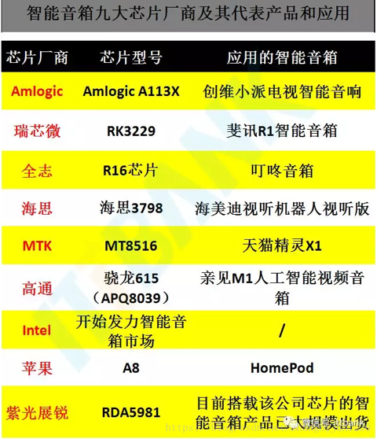

下面具体解释细节：

## MediaTeck MTK 联发科

| 智能音箱类产品名 | 产品外形图| 主控芯片 拆解图 | 主控芯片名 | 备注说明 |
| ------------- | -------- |  ------------ | --------- | ------ |
| GGMM智能音箱E2小度版 |  |  | MTK 联发科 MT7688AN | |
| 华为AI智能音箱 | 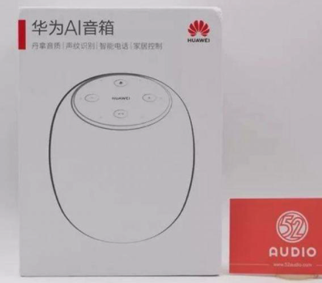 | 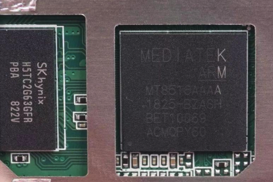 | MTK 联发科 MT8516 | |
| 荣耀YOYO智能音箱 |  | 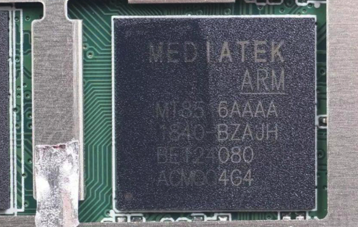 | MTK 联发科 MT8516 | |
| 京东叮咚mini2智能音箱 | 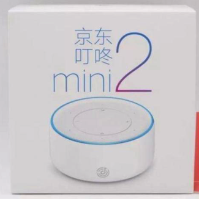 | 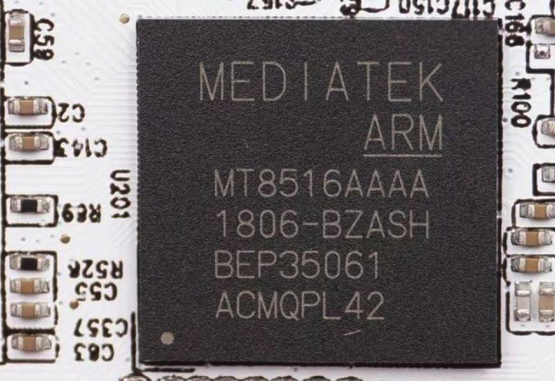 | MTK 联发科 MT8516 | |
| 出门问问Tichome Mini小问智能音箱 | 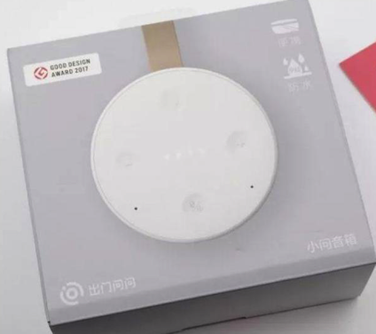 | 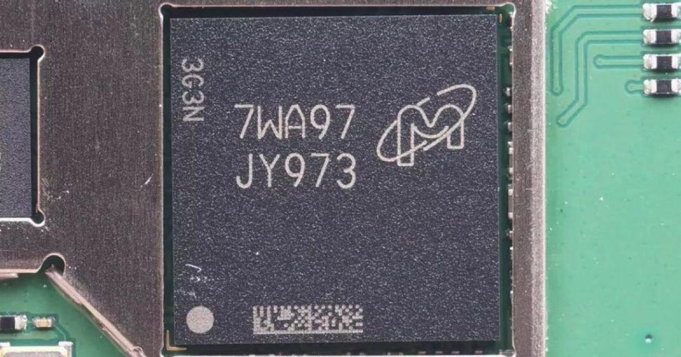 | MTK 联发科 MT2601 | |
| 小米米家智能语音后视镜 |  | 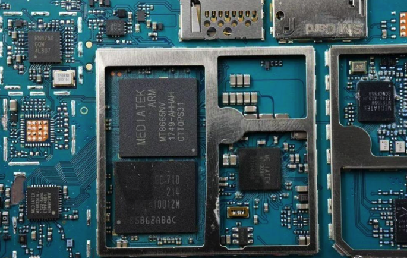 | MTK 联发科 MT8665NV | 智能行车记录仪 |
| 小米小爱智能闹钟 | 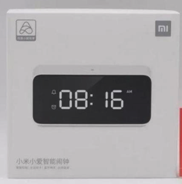 | 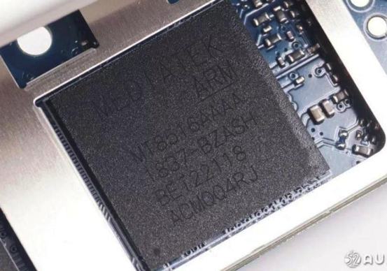 | MTK 联发科 MT8516 | |
| 天猫精灵M1智能音箱 | 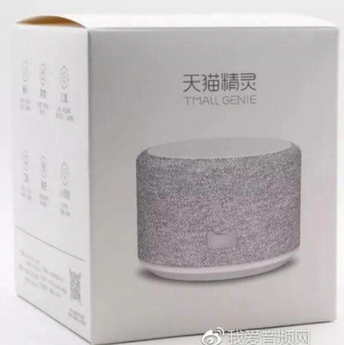 | 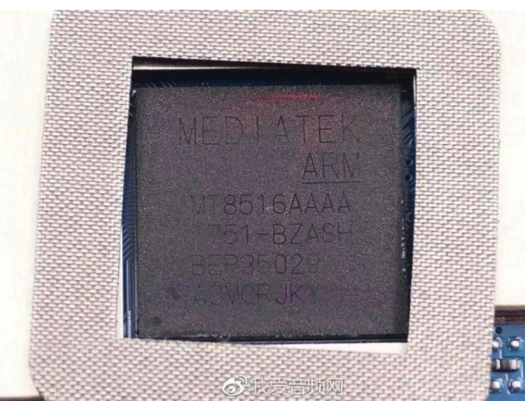 | MTK 联发科 MT8516 | |
| 天猫精灵方糖智能音箱 | 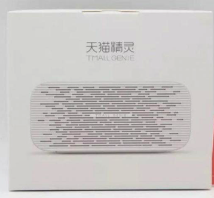 | 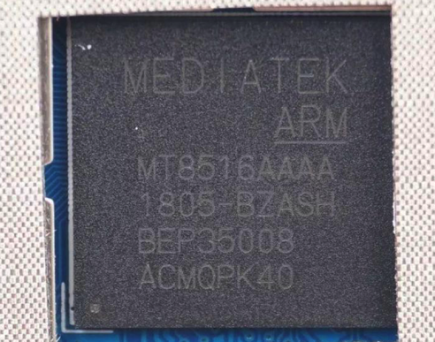 | MTK 联发科 MT8516 | 扬声器单元采用了小规格的3W/4Ω喇叭 |
| 天猫精灵TG_X1 | 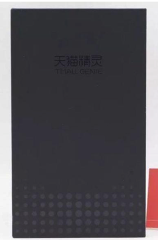 | 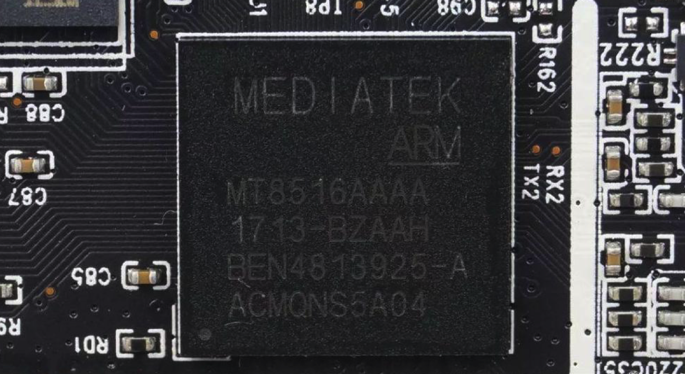 | MTK 联发科 MT8516 | 内部6颗麦克风，远场拾音比较出色 内置5W单扬声器 产品重量：400g 高度：8.3cm |
| 天猫精灵CC带屏智能音箱 | 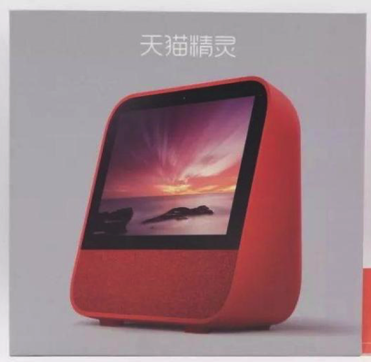 | 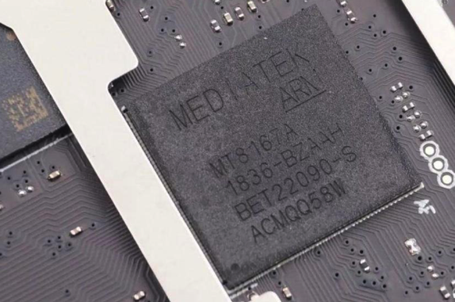 | MTK 联发科 MT8167A | |
| 腾讯叮当智能视听屏 智能音箱 |  | 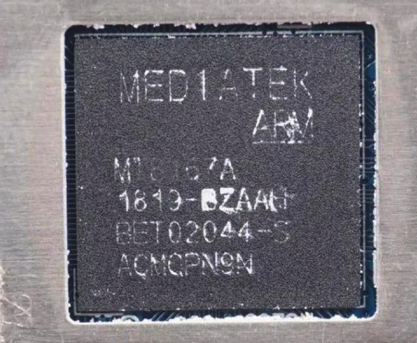 | MTK 联发科 MT8167A |   |

## MediaTek MTK 联发科 芯片

总结：

> 联发科的智能语音芯片方案在智能音箱市场中占较大市场份额，据我爱音频网拆解得知Huawei华为、JD京东、Mi小米、TmallGenie天猫精灵、Tencent腾讯、Honor荣耀、Mobvoi出门问问、GGMM古古美美等知名厂商均采用了MTK联发科智能语音解决方案
>
> 联发科的智能语音芯片方案中最为突出的是MTK联发科MT8516，这款芯片专用于智能音箱和语音助手市场，搭载了四个处理核心，进一步整合了Wi-Fi和蓝牙通信功能
>
> 据悉，联发科MT8516具有高硬件整合度，在软件层面开发了智能工具Power AQ，可有效地调整智能音箱音质，为硬件厂商缩短了产品开发进度，有效节省了产品上市周期
>
> 联发科凭借在智能音箱市场的前瞻性布局，收获了不少行业大单，占据了市场领先份额

芯片对比：

| 芯片名 | 厂家 | 介绍 | 备注 |
| ----- | --- | ---- | --- |
| MT7688AN | 联发科 | 可应用于家庭自动化的桥接中心  MT7688AN集成了 1T1R 802.11n Wi-Fi radio、580MHz MIPS 24KEc CPU、1-port fast Ethernet PHY、USB2.0 host、PCIe、SD-XC、 I2S/PCM，并支持多种低速输出入接口在单一颗系统单芯片当中。MT7688支持IoT gateway模式和IoT device模式 | |
| MT8516 | 联发科 | MTK 联发科 MT8516系列 是一个高效节能的处理器平台，专为支持云端服务的智能语音助手产品而设计，具有多种接口，可让音效设备及麦克风阵列处理发挥出最强性能 MTK 联发科 MT8516系列 配备四核心64位ARM Cortex-A35，主频达1.3GHz。 MT8516内建WiFi 802.11 b/g/n 和蓝牙4.0， 对PCB面积的需求更小，可让终端设备制造商简化产品设计、加快上市时间，也为开发更具创意性的产品提供了更多的可能性 MTK 联发科 MT8516系列 支持高达8通道的TDM麦克风阵列接口及2通道的PDM麦克风接口，非常适用于远距离(Far-field)麦克风语音控制与智能音响设备。此外，该芯片还提供多种内存规格，包括LPDDR2、LPDDR3、DDR3、DDR3L 和DDR4，满足各式各样的平台需求 | |
| MT2601 | 联发科 | 1.2G双核处理器 | |
| 7WA97 JY973 | 镁光 | 多合一的芯片，包含了4GB eMMC 、512MB LPDDR，以及MTK MT2601 | 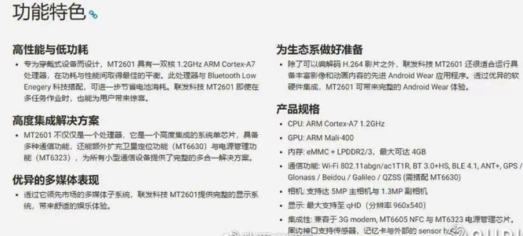 |
| MT8665NV | 联发科 | MTK联发科技 MT8665NV其采用28nm制程，内置1.5G四核A53处理器，内建硬件1080/720P硬件编码器，支持WIFI/BT/GPS/FM | |
| MT8167/MT8167A | 联发科 | MT8167A处理器，集成了一个四核ARM Cortex-A35 核心，运行频率可达1.5GHz，支持HEVC，H.264和MPEG-4等格式的视频，并且内置2.4G WiFi和蓝牙功能 | |

## Amlogic晶晨

| 智能音箱类产品 | 产品外形图| 音频相关芯片 拆解图| 主控芯片名| 备注说明|
| ----------- | -------- | --------------- | -------- | ----- |
| 百度小度智能音箱 | 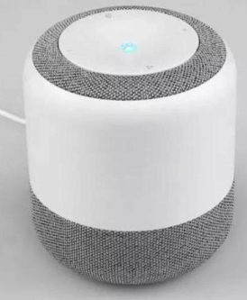 |  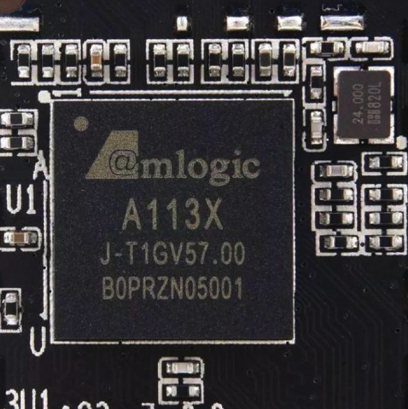 |Amlogic晶晨 A113X | |
| 百度小度智能音箱Pro | 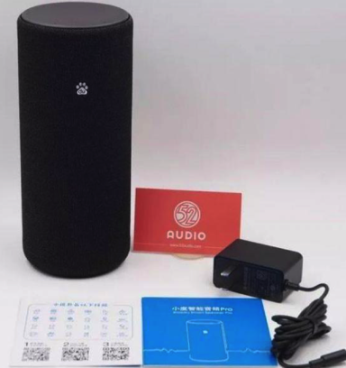 |  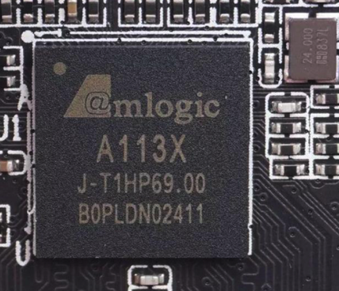 |Amlogic晶晨 A113X | |
| 小米AI音箱 | 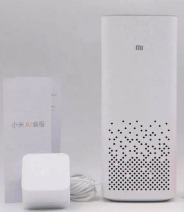 |  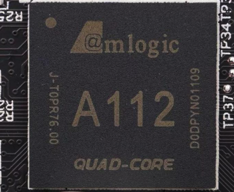 |Amlogic晶晨 A112 | |
| 小米小爱智能音箱HD |  |   |Amlogic晶晨 A113X | |
| 天猫精灵魔盒 | 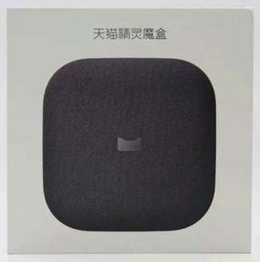 |  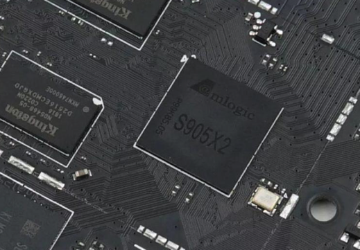 | Amlogic晶晨 S905X2 | |
| 双AI系统Yeelight语音助手  青岛亿联客信息技术有限公司 | 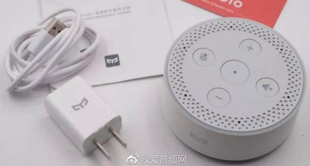 |  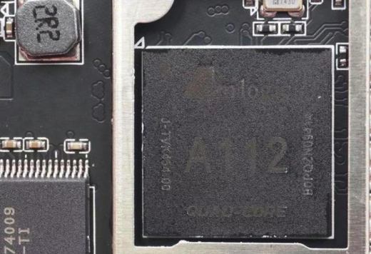 | 晶晨Amlogic A112 | Yeelight语音助手最大的特色就是内置微软小冰和小爱同学两套AI系统 |

### Amlogic晶晨 芯片

| 芯片名 | 厂家 | 功能介绍 | 备注说明 |
| ----- | --- | ------ | ------- |
| Amlogic A113X | 晶晨 | <ul><li>64位架构ARM Cortex A53 四核</li><li>支持所有高分辨率音频格式</li></ul> | 无需外加专用DSP芯片即支持主流远场拾音方案，运算力强大 |
| Amlogic A112 | 晶晨 | <ul><li>内置4核A53</li><li>1.2GHz主频</li><li>亮点：内置远场拾音<ul><li>无需外置音频处理芯片</li><li>集成在处理器中，是智能音箱和智能家居等应用的完美选择</li></li></ul> | |
| Amlogic A113X | 晶晨 | <ul><li>四个A53 CPU核心</li><li>超低功耗</li><li>多通道PDM数字麦克风接口</li></ul> | 强化了音频通道，凭借对前端及后端进行处理的软件数字信号处理算法，支持高保真音频输出 |
| Amlogic S905X2 | 晶晨 | <ul><li>四个ARM A53核心</li><li>运行频率最高1.896GHz</li><li>GPU为Dvalin MP2</li><li>支持DDR3/4、LPDDR3/4内存</li><li>支持4K H.265视频播放</li></ul> | |
