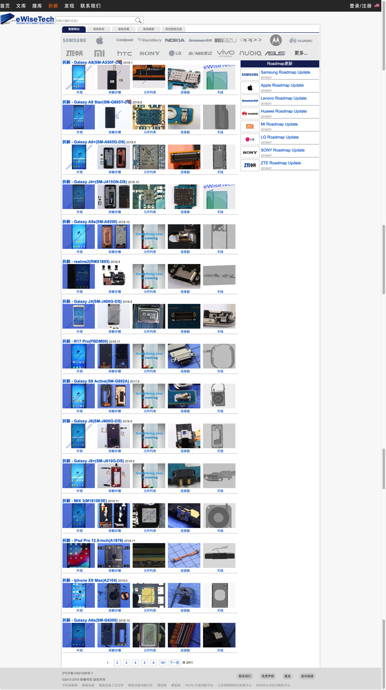

# 其他更多拆解报告

## 我爱音频网

[我爱音频网](http://www.52audio.com)

> 我爱音频网 www.52audio.com 是国内最早进行智能音频设备（智能音箱、蓝牙音箱、蓝牙耳机、USB-C/Lightning耳机）分析、评测、拆解的专业机构。

中的[智能音箱](http://www.52audio.com/archives/category/fix/intelligent_sound_box)里面，有其他更多的智能音箱的拆解报告。

随便列出一些（标题）供参考：

* 拆解报告：Amazon亚马逊 echo dot智能音箱
* 拆解报告：Google Home Hub 智能音箱
* 拆解报告：小雅Nano智能音箱
* 拆解报告：天猫精灵CC带屏智能音箱
* 拆解报告：小米小爱智能音箱HD
* 拆解报告：腾讯叮当智能视听屏 智能音箱
* 拆解报告：荣耀YOYO智能音箱
* 拆解报告： Google Home Mini智能音箱
* 拆解报告：小米小爱蓝牙音箱随身版
* 拆解报告：小米小爱智能闹钟
* 拆解报告：小度智能音箱Pro
* 拆解报告：米兔故事机

其中有几十款音频类设备的[拆解报告](http://www.52audio.com/archives/category/teardowns)：

## eWiseTech

[eWiseTech](https://www.ewisetech.com/Teardown)也有很多的拆解报告。

截图可见有很多，2000+，的硬件拆解报告：

