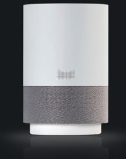
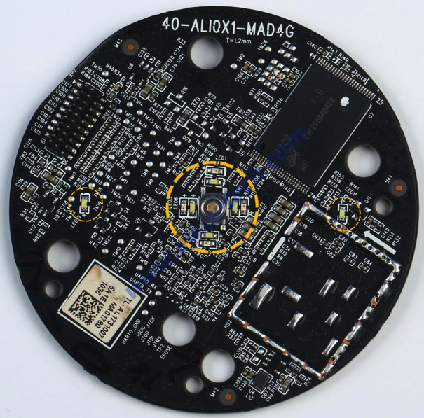
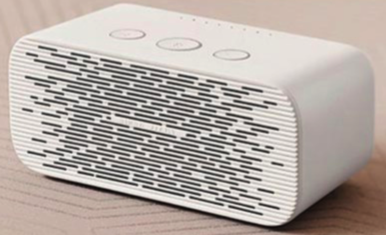
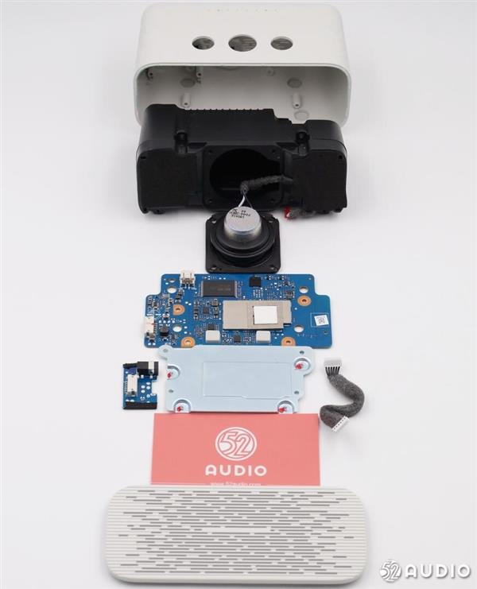
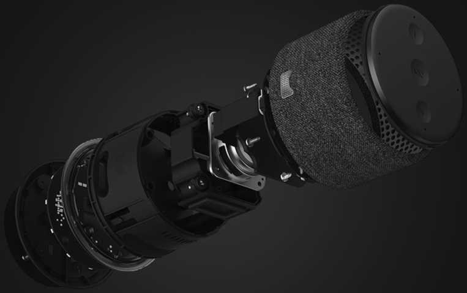
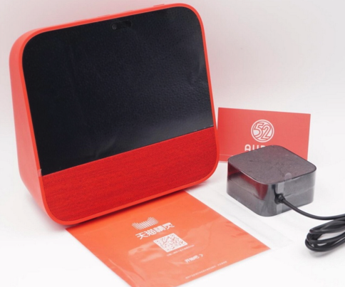
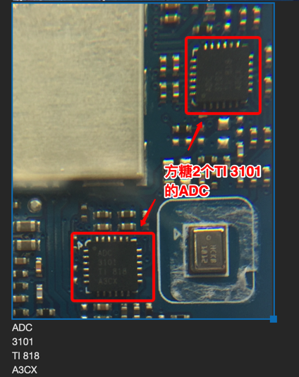

# BOM物料清单

下面整理出天猫精灵系列不同产品的BOM物料清单：

| 天猫精灵(Tmall Genie)系列产品名 | 产品外形 | 内部代号 | 核心硬件和参数 | BOM物料 |
| -------------------------- | --------- | ------ | ------------ | ------- |
| **X1** | 长的圆柱体   | TG_X1 | <ul><li>尺寸：83mm直径126mm高</li><li>操作系统：AliGenie语音助手</li><li>内置CPU: MTK MT8516</li><li>整机重量：400g</li><li>网络/蓝牙：24GWIFI+BT4.0</li><li>麦克风：6个</li><li>扬声器：5W 6欧姆</li></ul> | [Alibaba Tmall Genie TG_X1 BOM 物料清单](https://www.ewisetech.com/Device/SmartHome/Alibaba-Tmall-Genie\(TG_X1\)_id2634/BOM)    [三款天猫精灵智能音箱拆解对比：天猫精灵X1、M1、方糖 – 我爱音频网](http://www.52audio.com/archives/3218.html) |
| **方糖 C1** | 长方体   | TG_C1 | <ul><li>尺寸：134mm*65mm*59mm</li><li>操作系统：AliGenie语音助手</li><li>内置CPU：MTK MT8516</li><li>整机重量：265g</li><li>网络/蓝牙：WiFi 2.4G/BT 4.2</li><li>麦克风：2个</li><li>扬声器：3W 4欧姆</li></ul> | [三款天猫精灵智能音箱拆解对比：天猫精灵X1、M1、方糖 – 我爱音频网](http://www.52audio.com/archives/3218.html)  [两款热门迷你智能音箱拆解对比：天猫精灵方糖、小爱智能音箱mini – 我爱音频网](http://www.52audio.com/archives/3175.html)  [拆解报告：天猫精灵方糖智能音箱](http://www.sohu.com/a/233523088_257861)  [天猫精灵方糖内部硬件构造及拆机组图 - 天猫精灵吧](http://www.tianmaojingling8.com/p/171)   |
| **曲奇 M1** | 短的圆柱体     | TG_M1 | <ul><li>尺寸：94mm直径*63.5mm高</li><li>操作系统：AliGenie语音助手</li><li>内置CPU：MTK MT8516</li><li>整机重量：270g</li><li>网络/蓝牙：WiFi 2.4G/BT 4.2</li><li>麦克风：4个</li><li>扬声器：3W 4欧姆</li></ul> | [拆解报告：天猫精灵M1智能音箱](https://weibo.com/ttarticle/p/show?id=2309404227013182362858)  [三款天猫精灵智能音箱拆解对比：天猫精灵X1、M1、方糖 – 我爱音频网](http://www.52audio.com/archives/3218.html) |
| **CC带屏** |  | TG_S1 | | [拆解报告：天猫精灵CC带屏智能音箱 – 我爱音频网](http://www.52audio.com/archives/14729.html) |

天猫精灵X1、M1曲奇、方糖C1对比：

## 天猫精灵智能音箱系列产品的麦克风是否是TDM的？

* 问：天猫精灵X1、曲奇、方糖这三款产品里面的麦克风都是TDM的？
* 答：
  * 简答：是的
  * 详解：
    * 首先主控芯片都是：MTK 联发科 MT8516系列
      * 支持高达8通道的TDM麦克风阵列接口及2通道的PDM麦克风接口，非常适用于远距离(Far-field)麦克风语音控制与智能音响设备
    * 其次3款的麦克风（功放）芯片都是：[TI的TLV320ADC3101](http://book.crifan.com/books/smart_speaker_disassemble_summary/website/tmall_genie_candy_cube/chip_info_research/audio.html)
      * 属于：
        * 音频串行数据总线支持 I2S、左对齐/右对齐、DSP、脉冲编码调制 (PCM)、和时分复用 (TDM) 模式
      * 中的TDM
    * 而本身TDM的应用场景是：
      * 之前整理的[常用音频接口](http://book.crifan.com/books/common_logic_hardware_embedded/website/hardware_common/audio_knowledge.html)所提到的：
      * > 像现在最流行的语音智能音箱的7麦克风矩阵，一般都是用TDM来传的数据，同时可以传输7路麦克风输入和3路以上的音频反馈信号
    * 也从[这里](http://www.52audio.com/archives/3218.html)的
      * > 拾音效果：天猫精灵X1和曲奇均可以做到5米收音，区别在于X1为6麦克风矩阵，而曲奇则是4麦克风矩阵。方糖只有两个麦克风收音，收音距离为3米。但三款产品均采用了TI TLV320ADC3101模数转换芯片。
      * 得到验证
    * 最后，对于方糖来说：
      * 电路板上的 麦克风拾音的ADC（TI的ADC 3101）是2个
        * 
