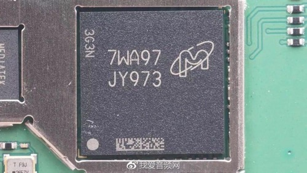

# 其他一些芯片

## 7WA97 JY973

从[某评测](https://www.jianshu.com/p/8df47126ddd1)看到的：



打标是：

```bash
7WA97
JY973
```

根据作者说法是：

> 来自镁光PoP封装芯片，这是一颗多合一的芯片，包含了4GB eMMC 、512MB LPDDR，以及MTK MT2601  1.2G双核处理器

经过自己的研究，没找到这些信息。

只找到了：

* JY973的Marking
  * 对应的是Micron的存储芯片Memory IC：`MT29PZZZ4D4BKEPK-18 W.94H`
    * 对应描述是：多芯片封装 SLC EMMC/LPDDR2 36G
    * 具体解释：
      * 多芯片封装=MCP=Multiple Chip Package=Multi-Chip Package
      * `MT29PZZZ4D4BKEPK-18 W.94H`属于：存储芯片
        * 一颗芯片内封装集成了2颗存储芯片
          * `4GB eMMC`
          * `4Gb=521MB LPDDR2`

-》 没有找到上面说的也集成了`MTK MT2601`

后来看到[这里](https://www.ewisetech.com/Pub/Article/11419)的说法是：

> Micron-512MB内存+4GB闪存

看来我的研究结果是对的：

* `JY973`的`marking`
  * 对应着芯片`Micron MT29PZZZ4D4BKEPK-18 W.94H`
    * 是颗存储芯片
      * 多合一的，多芯片封装(MCP)
      * 内置了，包含了，封装了：2颗芯片
        * 存储芯片：`4GB`的`eMMC`
        * `DRAM`内存：`521MB`的`LPDDR2`
    * 价格：14美元 = 93元 人民币
  * 另外一款类似的芯片是：`Micron MT29PZZZ4D4BKESK-18 W.94H`
    * `marking`是`JWB13`
