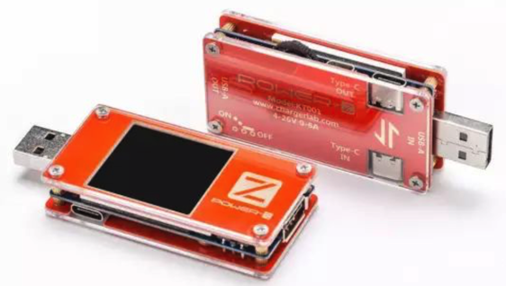
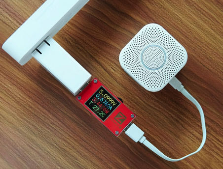

# 拆解评测工具

如果想要自己评测芯片或电路板的电量电压，可以用：

## POWER-Z KT001

* `POWER-Z KT001`
  * 长什么样：
    * 产品外形：
      * 
    * 使用起来什么样：
      * 
  * 功能：测试充电电压及电流
  * 支持设备类型：USB PD Type-C的设备
    * 市面上所有手机、充电宝、充电器、以及采用USB PD Type-C笔记本、平板电脑
  * 所属公司：`ChargerLAB`
    * 主页：http://www.chargerlab.com
    * 一家专注于充电领域的英文网站
  * 所属产品系列：`POWER-Z`
    * 还有其他产品：
      * `POWER-Z KM001`
      * `POWER-Z FL001`
