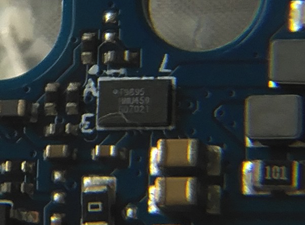
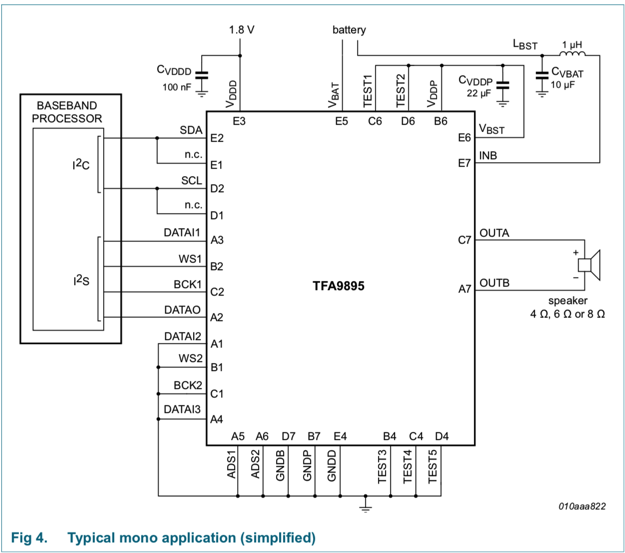
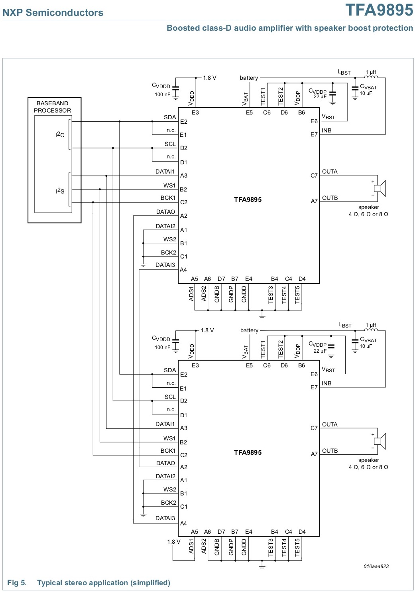
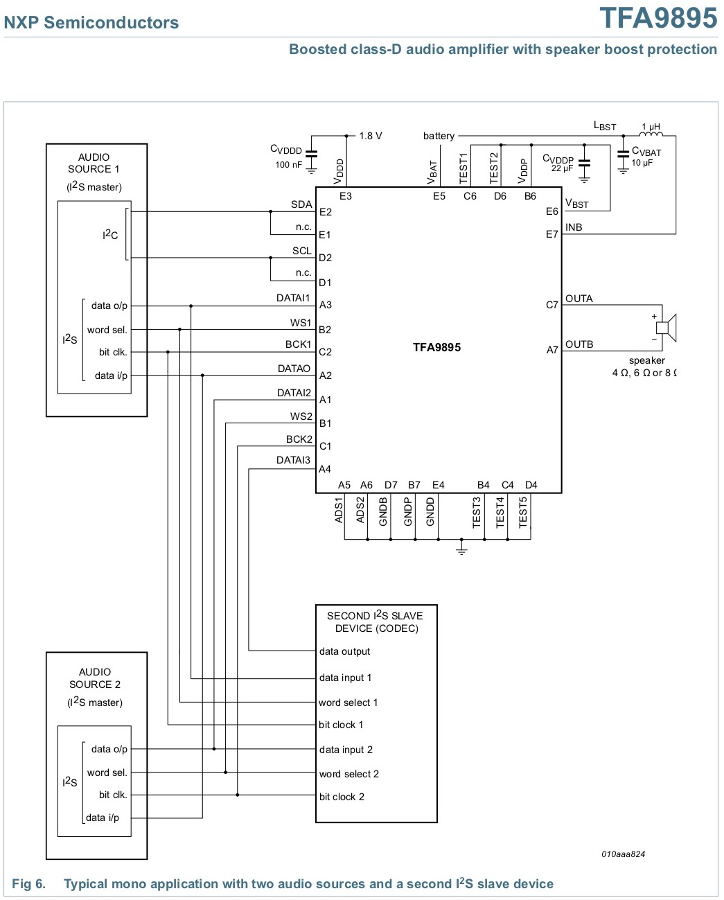
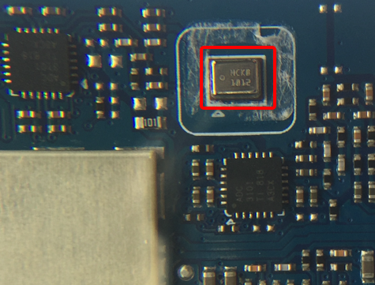
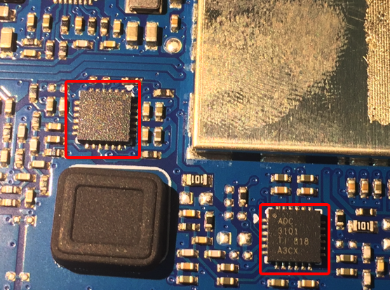
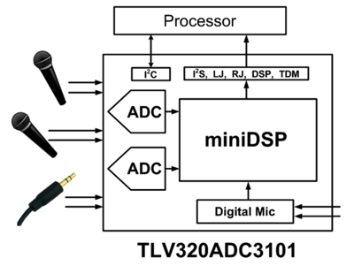

# 音频芯片

作为智能音箱的方糖，此处拆解后，和音箱关系密切的是音频类相关芯片：

> #### info:: 关于音频芯片
> 如果不了解`音频功率放大器`、`前置音频功率放大器`、`ADC`、`PDM`等音频相关知识，可以参考：[音频知识 - 音频功率放大器和前置音频功率放大器](http://book.crifan.com/books/common_logic_hardware_embedded/website/hardware_common/audio_knowledge.html)

## `音频功率放大器`

从电路板上：



看到的是：

```bash
T9895
HNU459
5D7021
```

经过研究：

* 最开始错以为
  * [三星 T9895](http://www.crifan.com/audio_amplifier_chip_samsung_t9895)
* 后来参考了[这个](https://news.mydrivers.com/1/579/579328_all.htm)才知道是
  * `NXP TFA9895`

### NXP TFA9895

* 芯片：`NXP TFA9895`
* 类型：`Audio Amplifier IC`=`音频功放芯片`
* 作用：增强音频功率
* 综述：
    * 增强型`D类`音频放大器，且具备扬声器升压保护和多频段动态范围压缩器
    * TFA9895是一款高效D类音频放大器，具有先进的扬声器升压保护算法，具有多频段压缩功能。它可以在电池电压为3.6 V下，为扬声器提供2.65 W（RMS; THD = 1％）输出功率。内部升压转换器将电源电压提升至5.3 V，为音质的重大改进提供充足的空间。
* 更详细的技术细节
  * （1）Typical mono application (simplified)
    * 
  * （2）Typical stereo application (simplified)
    * 
  * （3）Typical mono application with two audio sources and a second I2S slave device
    * 

## `前置音频放大器` = `麦克风`

从电路板上：



看到的是：

```bash
HCKB
1012
```

经过研究，搜字母，找不到芯片信息。后来参考[这里](http://www.52audio.com/archives/3175.html)得知是：

`前置音频放大器`：`TI LMV1012`

### TI德州仪器的`LMV1012`

* `Part Number`：`LMV1012`
* 是什么：`Pre-Amplified IC`=`前置音频放大器`
* 作用：
  * 增强音频信号
  * 降噪：去除环境和RF的噪音
* 一句话简述：
  * Pre-Amplified IC's for High Gain 2-Wire Microphones
    * 一款专为2线驻极体电容器麦克风而设的放大器
* 详细介绍：
  * The LMV1012 is an audio amplifier series for small form factor electret microphones. This 2-wire portfolio is designed to replace the JFET amplifier currently being used. The LMV1012 series is ideally suited for applications requiring high signal integrity in the presence of ambient or RF noise, such as in cellular communications. The LMV1012 audio amplifiers are specified to operate over a 2.2V to 5.0V supply voltage range with fixed gains of 7.8 dB, 15.6 dB, 20.9 dB, and 23.8 dB. The devices offer excellent THD, gain accuracy and temperature stability as compared to a JFET microphone.
* 特点
  * 较高的抗射频干扰能力
  * 更低的失真率：0.1%的总谐波失真率
  * 高信噪比SNR：>=55dB
  * 低功耗
    * 所需供电不超过240μA
    * 有助延长电池寿命
* 应用领域：
  * 移动型通信设备
  * 汽车辅助设备
  * 移动电话
  * 个人数字助理
* 封装：4 焊球micro SMD
* 价格：0.39美元/片

## 模拟转数字 ADC

电路板上：



写的是：

```bash
ADC
3101
TI 818
A3CX
```

去研究和参考[畅销的智能音箱都在用！TI德州仪器音频芯片应用大揭晓 – 我爱音频网](http://www.52audio.com/archives/6698.html)后得知是：

ADC芯片 TI TLV320ADC3101

### ADC芯片：`TI TLV320ADC3101`

* spec
    * http://www.ti.com/lit/ds/symlink/tlv320adc3101.pdf
* 完整型号：TI的TLV320ADC3101
    * TI=Texas Instruments=德州仪器
* 一句话综述：
    * 92dB SNR Low-Power Stereo ADC With Digital Mic Support and miniDSP
    * 用于无线手持终端和便携式 A 的低功耗立体声 ADC（具有嵌入式微型 DSP）
    * 用于无线电话听筒和便携式音频设备并装有嵌入式小型数字信号处理器 (miniDSP) 的低功耗立体声数模转换器 (ADC) 
* 更详细的解释是：
    * The TLV320ADC3101 device is a low-power, stereo audio analog-to-digital converter (ADC) supporting sampling rates from 8 kHz to 96 kHz with an integrated programmable-gain amplifier providing up to 40-dB analog gain or AGC. A programmable miniDSP is provided for custom audio processing. Front-end input coarse attenuation of 0 dB, –6 dB, or off, is also provided. The inputs are programmable in a combination of single-ended or fully differential configurations. Extensive register-based power control is available via an I2C interface, enabling mono or stereo recording. Low power consumption makes the TLV320ADC3101 ideal for battery-powered portable equipment.
* 芯片用途：
    * 用于实现 Analog模拟信号 转换为 数字Digital信号
        * ADC=Analog Digital Convertor=模拟数字转换器
    * -》此处指的是，将
        * （从麦克风输入的）语音模拟音频信号
        * 转换为
        * 数字的音频信号（供后续音频设备处理和播放）
* 典型的功能框架图
  * 
* 典型的用途/使用场景：
    * Wireless Handsets
    * Portable Low-Power Audio Systems
    * Noise-Cancellation Systems
    * Front-End Voice or Audio Processor for Digital Audio

### 其他相关和说明

#### 此芯片不是snas483f

此芯片，不是（从 TI 818 ADC 搜出来的，另外一款芯片）

* ADC128D818
  * http://www.ti.com/lit/ds/snas483f/snas483f.pdf
  * ADC128D818 12-Bit, 8-Channel, ADC System Monitor With Temperature Sensor, Internal –External Reference, and I2C Interface
  * ADC128D818 具有温度传感器、内部/外部参考和 I2C 接口的 12 位、8 通道、ADC 系统监控器

#### 类似但用于汽车领域的TLV320ADC3101-Q1

还有另外一款和TLV320ADC3101类似的芯片：TLV320ADC3101-Q1

[用于无线手持终端和便携式 A 的低功耗立体声 ADC（具有嵌入式微型 DSP） | 德州仪器 TI.com.cn](http://www.ti.com/product/cn/TLV320ADC3101-Q1)

其主要是用于汽车automotive领域

* 汽车领域的要求就比较高：
    * Automotive - Q100 devices qualified for high-reliability automotive applications targeting zero defects
    * 要求了：
        * 高可用性high-reliability
        * zero defects 0缺失效率-》不能有任何失效
* 所以适用于电池供电便携式设备中
  * 与之相对：TLV320ADC3101适用于无线手持终端

#### TLV320ADC3101同系列的高性能音频ADC

包括TLV320ADC3101，TI家的同品类的，即 具有出色音质的高性能音频 ADC，还有：

* PCM9211
    * [具有立体声 ADC 和路由功能的 216kHz 数字音频接口收发器 (DIX)](http://www.ti.com/product/PCM9211)
* TLV320ADC3101
    * [支持数字麦克风和 miniDSP 的 92dB SNR 低功耗立体声 ADC](http://www.ti.com/product/TLV320ADC3101)
* PCM1808
    * [具有单端输入的 99dB SNR 立体声 ADC](http://www.ti.com/product/PCM1808)

详见：[音频 ADC | 概述 | 音频转换器 | 德州仪器 TI.com.cn](http://www.ti.com.cn/zh-cn/audio-ic/converters/adc/overview.html)

#### TI家的还有其他更多种类的音频类芯片

* 音频放大器 (279)
    * 扬声器放大器 (204)
    * 音频 运算放大器 (50)
    * 耳机放大器 (26)
* 音频转换器 (157)
    * 音频 ADC (28)
    * 音频 DAC (59)
    * 音频编解码器 (58)
    * 音频 USB 转换器 (12)
* 音频接口 (33)
    * 音频线路驱动器 (9)
    * 音频线路接收器 (8)
    * SPDIF 收发器 (8)
    * 采样速率转换器 (8)
* 媒体和音频处理器 (40)
* 专用音频 (40)
    * 麦克风前置放大器 (8)
    * 音量控制 IC (6)
    * 音频开关 (11)
    * 唇型同步延迟 IC (3)
    * PWM 调制器 (3)
    * 压电式扬声器驱动器/接收器 (4)
    * 音频时钟 (5)

详见：[音频 ADC | 概述 | 音频转换器 | 德州仪器 TI.com.cn](http://www.ti.com.cn/zh-cn/audio-ic/converters/adc/overview.html)

#### 关于智能音箱中的音频芯片的设计

音频芯片设计难点：

* 成本更低
    * 音质与成本间的平衡
* 电池寿命、热量
* 回声消除
* 体积更小
    * 音质更好
