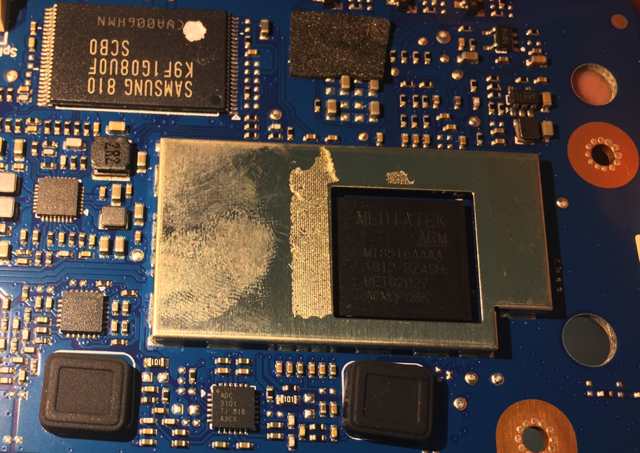
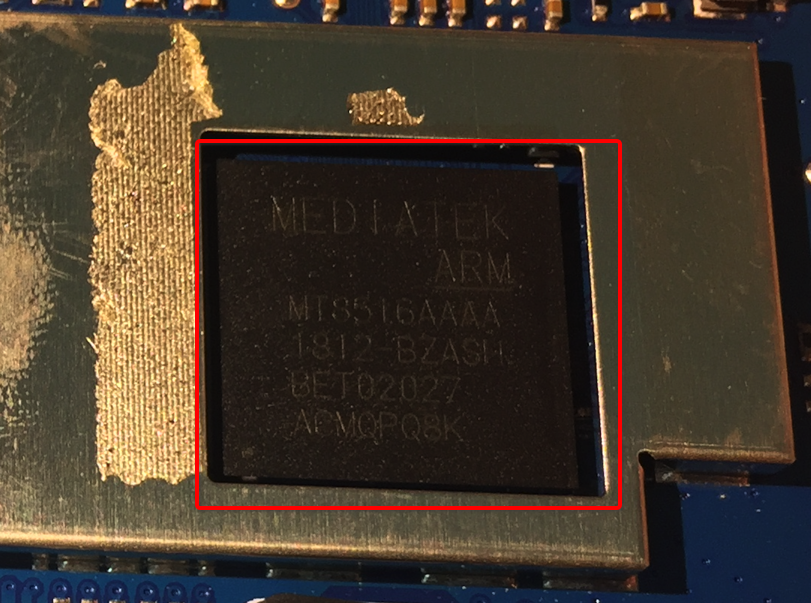
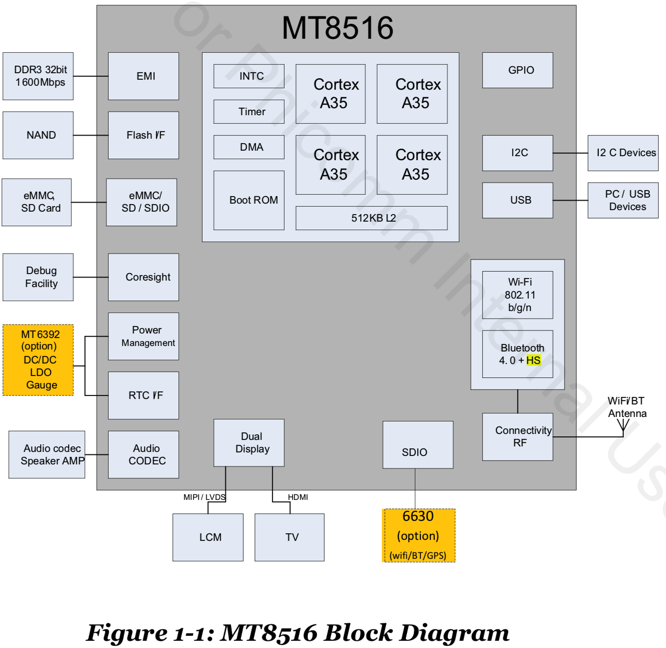
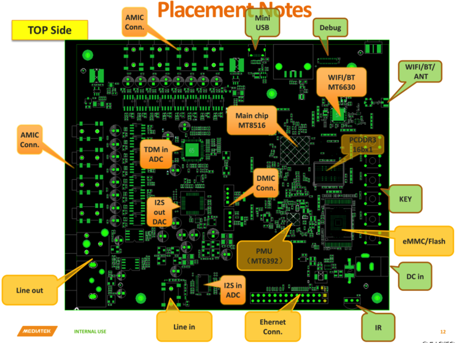
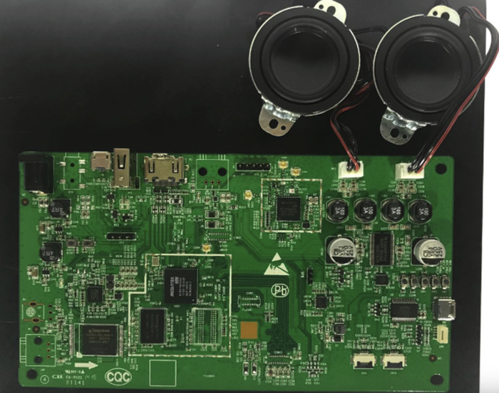
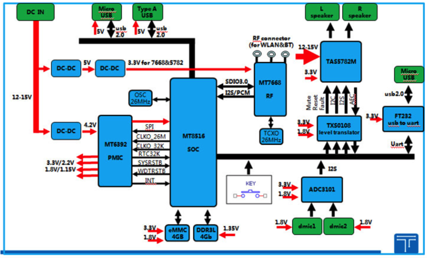

# 主控芯片

电子设备的大脑是主控芯片，往往也叫做：`CPU`，`SoC`等。

> #### info:: CPU名词解释
> 如果对于常见的CPU相关的名词，比如`SoC`, `MCU`等等，不熟悉，可以参考单独的教程：[芯片产业链总结](http://book.crifan.com/books/ic_chip_industry_chain_summary/website) 中的： [芯片名词对比](https://book.crifan.com/books/ic_chip_industry_chain_summary/website/ic_chip_summary/chip_names_compare.html)

此处方糖的CPU是`MTK MT8516`

是从电路板：



上看到的信息是：



经过查询研究整理，得到CPU的信息：

## 天猫精灵方糖的Soc是：`联发科 MTK MT8516`

此处拆解的：天猫精灵方糖的主控芯片=`CPU`=`SoC`是：**联发科 MT8516**=`MTK MT8516`

芯片上面的marking打标是：

```bash
MEDIATEK
ARM
MT8516AAAA
1812-BZASH
BET02027
ACMQPQ8K
```

其含义，根据spec规范文档的解释：

* 核心：基于`ARM`
* `Part No`=Part Number：`MT8516AAAA`
  * 另外也有：`MT8516AAAB`
* `1812`：`Data Code`=数据代码？
* `BZASH`中的`S`：`Subcontractor Code`=`转包商编码`
  * 此处的指的是 这款芯片供应给某一家，该家代号是`S`
    * 如果找联发科内部人员问，应该能查到具体是哪家公司
* `ACMQPQ8K`：`Lot ID`？

## 从芯片角度的综述：MTK MT8516

MTK MT8516芯片本身参数：

* Platform Features
    * AP
        * 内核：
            * 4核 Cortex-A35
            * 频率：1.3GHz
        * 指令集：
            * 支持NEON：专门针对大规模到并行运算而设计
                * SIMDv2
                * VFPv4 ISA
        * 缓存：
            * L1：
                * 指令缓存：32KB
                * 数据缓存：32KB
            * L2：521KB
        * 电压：支持DVFS(动态电压频率调整)
            * 1.05V~1.31V
    * 无线网络
        * 主控芯片MCU：Andes N9
            * 缓存：
                * 指令缓存：48KB
                * 数据缓存：40KB
    * 外部存储接口
        * 支持类型：
            * LPDDR2
            * LPDDR3
            * DDR3/L
            * DDR4
        * 容量：最大2GB
        * 总线带宽：32位
        * 频率：最大800MHz
        * 支持模式：
            * 自刷新
            * 局部刷新
        * 支持低功耗
    * 安全
        * ARM TrustZone
    * Storage
    * Connectivity
    * Operating conditions
    * Package
* Multimedia Features
    * Display
    * Audio
    * Speech
    * HDMI transmitter
* Wi-Fi/Bluetooth Features
    * Supports integrated Wi- Fi/Bluetooth
    * Wi-Fi
    * Bluetooth

### MTK MT8516概况

MediaTek有一套领先的SoC设计，可以把digit数字部分和RF射频部分，整合到单一芯片内。
其中电源管理模块(PMIC) MT6392用于给各个模块供电。

MediaTek MT8516

* 集成了：
  * 802.11 b/g/n
  * 蓝牙4.0
  * HS radios
  * 无源设备IPD
* 主要用于：
  * 有连接的，音频方案
* 整合了：
  * 64位，4核 Cortex-A35，1.3GHz的ARM
  * 丰富的存储接口：
    * PCDDR3
    * DDR4
    * LPDDR3
    * eMMC
    * Raw NAND
* 加速研发和产品上市时间
  * 提供了MMD (MediaTek Module Design)
    * 用于快速验证电路图和PCB电路板的存储和电源设计
  * 如果要求高端的WiFi (802.11ac)或蓝牙
    * 可以配合：五合一无线SOC处理器MT6630
* 最大特点：
  * 高性能
  * 低功耗
  * 良好的多媒体体验

### MTK MT8516产品参数

* Audio Features
  * Google Cast for Audio:Yes
  * Cloud-connected Voice Assistants: Yes
  * PowerAQ:Yes
  * Interface:DMIC,  Fast Ethernet,  I2S,  HDMI 1.4 with ARC,  S/PDIF,  TDM in/out
  * Additional Features: I2Sx2 (4 channels), TDM (up to 8 channels), PDM inputs (2 channels), 2 channel audio DAC and ADC
* Connectivity
  * Connectivity:Bluetooth,  USB 2.0 with OTG,  Wi-Fi
  * Wi-Fi:b/g/n
  * Bluetooth Version:4.2 (Low Energy)
* Processor
  * CPU Type:ARM Cortex-A35
  * CPU Cores:Quad (4)
  * CPU Bit:64-bit
  * CPU Frequency:1.3GHz
  * Memory:LPDDR2,  DDR3,  LPDDR3,  DDR3L,  DDR4

### MTK MT8516框架图



MT8615芯片本身中的各个模块的布局图：



## 产品和用途角度的综述：MTK MT8516

来自[联发科官网](https://www.mediatek.cn/products/audio/mt8516)更简洁的概述：

MT8516，是高度整合的应用程序处理平台，适用於使用 Google Cast 和 PowerAQ 的云端连结语音助理。

> #### note:: PowerAQ
> * what：联发科技的智能调音工具
> * can：支持信号流设计和音频参数调整，提供简单的 GUI 界面
> * why：无需额外的 DSP 支持，优化音箱的音质，让产品的音质更具魅，实现媲美加装了高端DSP的效果

MT8516 是一个高效并高度集成的应用程序处理平台，具有不同的接口和连接，主要用于音频和麦克风的处理。它是为云端支持的语音助手设备、Google Cast 音频和搭载联发科技的 PowerAQ 产品而设计。

MT8516 集成了四核 64 位的 ARM® Cortex-A35 MPCoreTM ，其运行速度高达 1.3 GHz。除了原始的 NAND 支持之外，它还具有非常灵活的内存支持，包括 LPDDR2、LPDDR3、DDR3、DDR3L 和 DDR4，以适应不同的平台需求。 麦克风语音输入控制和连接的音频产品中包含 I2Sx2（4 个频道）、TDM（最多 8 个频道）和 PDM 输入（2 个频道）等广泛的接口。连接包括 USB 2.0 OTG、10/100 以太网 MAC、具有 ARC 的 HDMI 1.4 Tx、SPDIF 和嵌入式两声道音频 DAC 和 ADC。
MT8516 平台拥有该行业最先进的集成技术，包括 Wi-Fi（2.4GHz 802.11 bgn）和蓝牙，以及内置的射频单芯片。这不仅简化了设计，缩短了上市时间，还缩小了平台尺寸，从而让设备厂商有机会设计其更小、更高效的产品。

芯片MT8516的典型用途：

* 除了集成度非常高：
  * 四核心64位ARMCortex-A35，主频达1.3GHz
  * 内建WiFi802.11b/g/n和蓝牙4.0
* 还支持
  * 高达8通道的TDM麦克风阵列接口和2通道的PDM数字麦克风接口
    * -》非常适用于远场(Far-field)麦克风语音控制和智能音响设备
      * 关于PDM，详见：
        * [音频知识 - 常见音频接口和协议标准](http://book.crifan.com/books/common_logic_hardware_embedded/website/hardware_common/audio_knowledge.html)
  * PowerAQ调音工具
* 所以常见用途和场景：AI语音识别及控制功能
  * -》例如智能闹钟、火灾警报器及其他小型智能家用装置
* 注：目前智能音箱产品中，有超过70%采用了联发科的芯片

## 其他相关

另外也可以买基于MT8516的开发板去折腾物联网的开发。

比如：



系统架构图：


