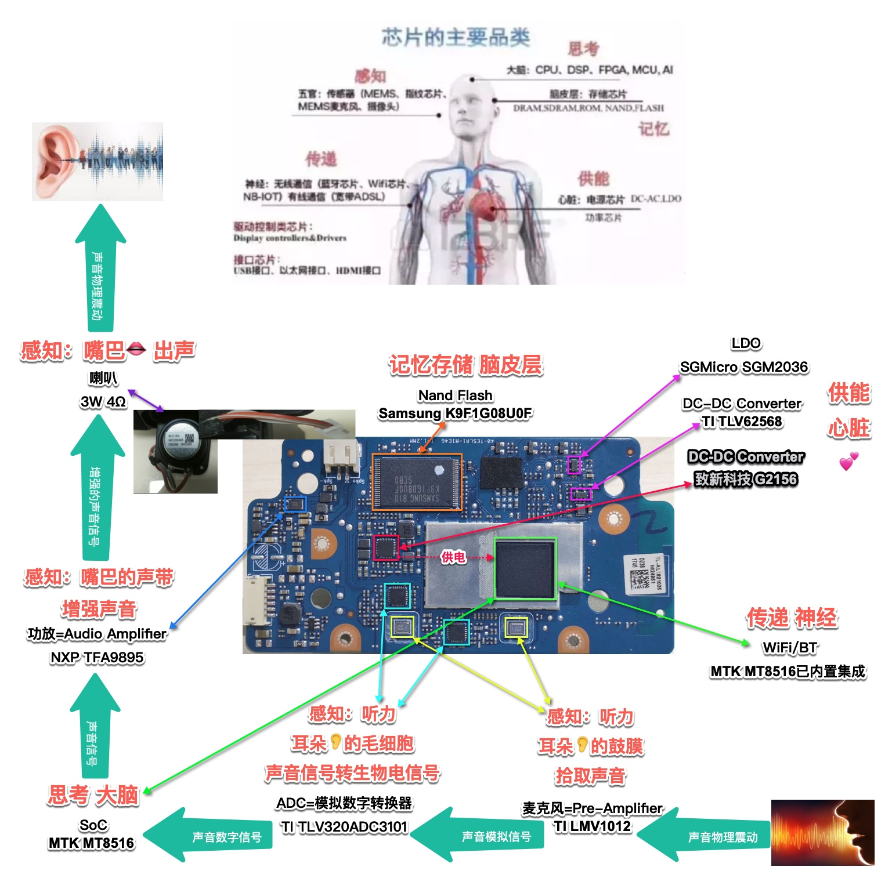
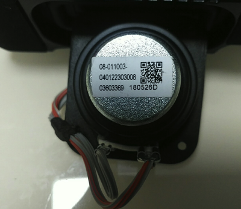
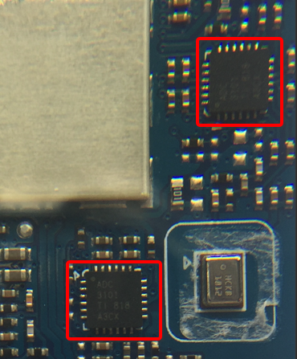
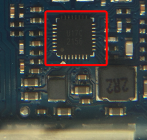
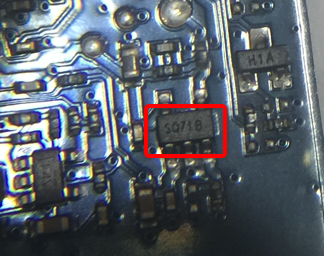

# 拆解报告和BOM

此处整理一下`天猫精灵`的`方糖`的拆解报告，以及分析出BOM物料清单。

对于拆解后的主电路板

下面详细整理BOM清单和芯片信息：

## 用人体类比天猫精灵方糖电路板上芯片功能

对应的芯片和功能，用人体去类比效果如下：

## 天猫精灵方糖的BOM物料清单

天猫精灵方糖的硬件拆解报告和BOM的详细参数是：

| **功能模块** | 电路板上标识**Marking** | **芯片和参数** | 备注说明 |
| ------- | ------------------- | ----------| --------|
| `CPU`=`主控芯片`=`SoC` |  | <ul>MTK MT8516<li>64位，4核 ARM Cortex-A35，主频1.3GHz</li><li>支持丰富的存储接口：Raw NAND、eMMC、LPDDR2/LPDDR3/DDR3/DDR3L/DDR4</li><li>支持丰富的音频接口：I2Sx2（4 个频道）、TDM（最多 8 个频道）和 PDM 输入（2 个频道）</li><li>内置了无线功能：Wi-Fi（2.4GHz 802.11 bgn）和蓝牙4.0</li><li>支持其他各种接口：USB 2.0 OTG、10/100 以太网 MAC、具有 ARC 的 HDMI 1.4 Tx、SPDIF 和嵌入式两声道音频 DAC 和 ADC</li></ul> | 详见：  [联发科MT8516](http://book.crifan.com/books/smart_speaker_disassemble_summary/website/tmall_genie_candy_cube/chip_info_research/cpu.html)  [常见主控芯片 - MediaTeck MTK 联发科](http://book.crifan.com/books/smart_speaker_disassemble_summary/website/common_smart_speaker/cpu_soc.html)  [芯片名词对比](https://book.crifan.com/books/ic_chip_industry_chain_summary/website/ic_chip_summary/chip_names_compare.html) |
| 存储芯片 |  | <ul>Samsung K9F1G08U0F<li>容量：1Gb=128MB</li><li>电压：3.3V</li><li>封装：TSOP</li><li>IO速度：40 Mbps</li></ul> | [存储芯片 Nand Flash Samsung K9F1G08U0F](http://book.crifan.com/books/smart_speaker_disassemble_summary/website/tmall_genie_candy_cube/chip_info_research/storage.html) |
| 麦克风=收音麦克风=拾音麦克风=前置音频放大器 |  | <ul>TI LMV1012<li>Pre-Amplified IC=前置音频放大器</li><li>一款专为2线驻极体电容器麦克风而设的放大器</li><li>较高的抗射频干扰能力</li><li>更低的失真率：0.1%的总谐波失真率</li><li>高信噪比SNR：>=55dB</li><li>低功耗</li><li>封装：4 焊球micro SMD</li></ul> | [音频芯片 前置音频放大器](http://book.crifan.com/books/smart_speaker_disassemble_summary/website/tmall_genie_candy_cube/chip_info_research/audio.html)  [音频功率放大器 和 前置音频功率放大器](http://book.crifan.com/books/common_logic_hardware_embedded/website/hardware_common/audio_knowledge.html)  收音麦克风虽然只有两个，但是均经过深度定制的收音麦克风，效果也还不错，可以实现3米的拾音范围 |
| 音频功率放大器=功放 |  | <ul>NXP TFA9895<li>增强型高效D类音频放大器</li><li>扬声器升压保护</li><li>多频段动态范围压缩</li><li>2.65W输出功率(3.6 V下)</li><li>可升压至5.3V</li></ul> | [音频芯片 音频功率放大器](http://book.crifan.com/books/smart_speaker_disassemble_summary/website/tmall_genie_candy_cube/chip_info_research/audio.html)  [音频功率放大器 和 前置音频功率放大器](http://book.crifan.com/books/common_logic_hardware_embedded/website/hardware_common/audio_knowledge.html) |
| 扬声器=喇叭 |  | <ul><li>功率：3W</li><li>阻抗：4Ω</li></ul> | |
| 无线网络 | | <ul>MTK8516内置<li>WiFi：802.11 b/g/n</li><li>蓝牙：4.0</li></ul> | |
| ADC=模拟数字转换器 |  | <ul>ADC TI TLV320ADC3101<li>低功耗立体声</li><li>波特率：8kHz ~ 96KHz</li><li>最高模拟增益：40dB</li><li>高信噪比SNR：96dB</li><li>支持：数字麦克风和miniDSP</li></ul> | |
| 降压转换器 |  | <ul>致新科技 G2156<li>4路同步整流降压转换器</li><li>一路3A输出</li><li>三路1A输出</li><li>1MHz开关频率</li><li>可调节的软启动</li><li>PG信号输出</li><li>逐周期电流限制，过热和过载保护</li><li>封装：TQFN</li></ul> | [同步整流降压转换器 致新科技 G2156](http://book.crifan.com/books/smart_speaker_disassemble_summary/website/tmall_genie_candy_cube/chip_info_research/power_management.html)  为主控芯片`MTK MTK8516`供电 |
| 输出低压差稳压器 |  | <ul>圣邦威电子 sgmicro SGM2036<li>Low Power, Low Dropout, RF Linear Regulator</li><li>输入电压：1.6V~5.5V</li><li>输出电流：300mA</li><li>低输出噪音和高PSRR</li></ul> | [圣邦威电子 sgmicro的SGM2036](http://book.crifan.com/books/smart_speaker_disassemble_summary/website/tmall_genie_candy_cube/chip_info_research/power_management.html)  [什么是降压变换器及为何需要降低电压](http://book.crifan.com/books/common_logic_hardware_embedded/website/hardware_common/audio_knowledge.html) |
