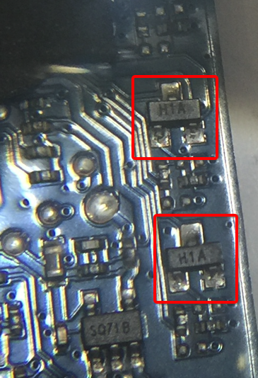
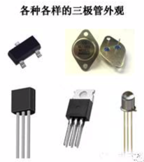
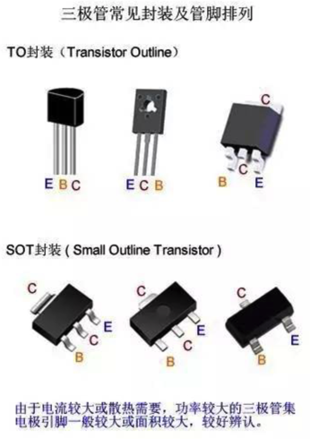
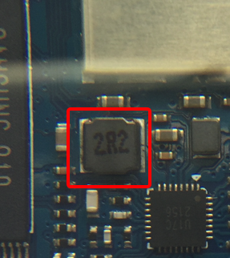
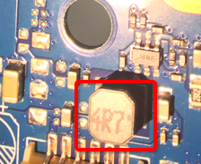
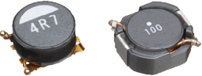

# 其他芯片

除了CPU，存储，音频，电源管理外，其他还有一些芯片和原器件：

## 三极管

电路板上：



看到的是：

```bash
H1A
```

[其他](http://www.sohu.com/a/233523088_257861)类似的还有：`W1A`

后来经过研究得知是：

H1A, W1A等

* 是什么：`半导体三极管`
  * 又称：`贴片三极管`, `三极管`
* `三极管`
  * 是什么：`电流控制`原器件
  * `作用`/`功能`：
    * `放大电流`
      * =放大电信号
        * 把微弱的电信号变成一定强度的信号
    * `开关`
  * 别称
    * `半导体三极管`
    * `晶体三极管`
    * `双极型三极管`
  * 长啥样
    * 
    * 
* 所属型号
  * `MMBT3904`
    * 好像有多家：
      * [ds30036](https://www.diodes.com/assets/Datasheets/ds30036.pdf)
      * [MMBT3904](https://assets.nexperia.com/documents/data_sheet/MMBT3904.pdf)
    * 推测是：通用的类型的编号，而不是某个厂家的某款芯片的编号
  * `3DG3904M`

## 电容电感电阻

电路板上：





看到了：

* 2R2
* 4R7

经过研究得知是：电感

以及电路板上其他小原器件，比如电容，电阻等

对此去整理具体作用：

### 二端元件及作用总结

在我们研究的电路中一般含有：

* 二端元件：有两个端钮与其它元件相连接
  * 包括
    * `电阻元件`
    * `电容元件`
    * `电感元件`
    * `电源元件`
  * 分类
    * `无源元件`：不产生能量
      * `电阻元件`
      * `电容元件`
        * 电容器是一种能够`储藏电荷`
      * `电感元件`
        * 主要起到`滤波`、`振荡`、`延迟`、`陷波`等作用，还有`筛选信号`、`过滤噪声`、`稳定电流`及`抑制电磁波干扰`等作用。
        * 对交流信号进行`隔离`、`滤波`
          * 与电容器、电阻器等组成`谐振电路`
    * `有源元件`：提供能量的元件
      * `电源元件`
  * 总结
    * `电容`+`电感`=`LC滤波电路`
      * 用法：
        * 电感在电路最常见的作用就是与电容一起，组成`LC滤波电路`
      * 特性：
        * `电容`：`阻直流，通交流`
        * `电感`：`通直流，阻交流` = 阻止交流电通过而让直流电顺利通过
          * 频率越高，线圈阻抗越大
      * 举例：
        * 如果把伴有许多干扰信号的直流电通过LC滤波电路，那么交流干扰信号将被电感变成热能消耗掉，变得比较纯净的直流电
        * 直流电流通过电感时，其中的交流干扰信号也被变成磁感和热能，频率较高的最容易被电感阻抗，这就可以抑制较高频率的干扰信号

### 电感原件

比如：



具体参数含义：

* `4R7` = `4.7 uH`
  * `uH`=`微享`
* `100` = 10 × 10^0 = `10 uH`
* `101` = 10 × 10^1 = `100 uH`
