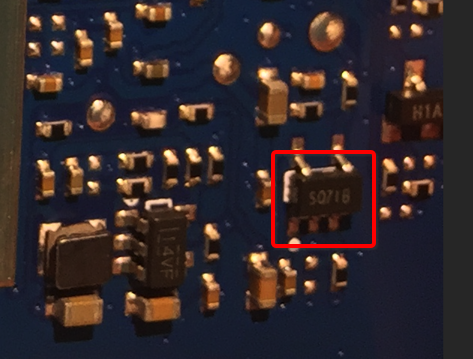
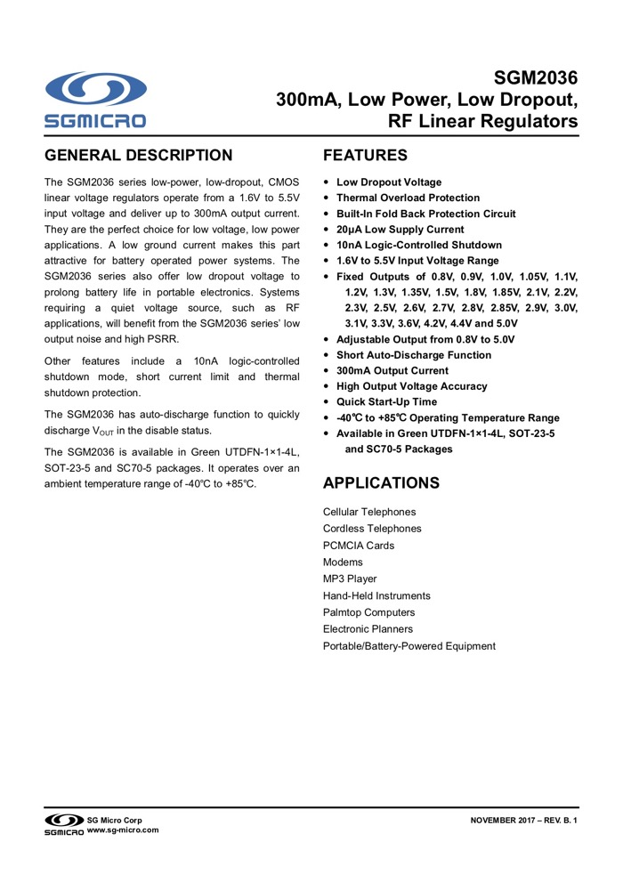
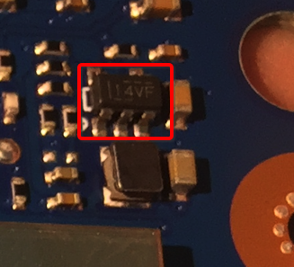
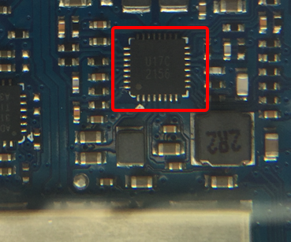

# 电源管理芯片

电路板中有一些负责给各种芯片提供合适电压和电流的`供电`=`电压转换`=`电源管理` 芯片。下面整理详细信息：

## CMOS线性稳压器

电路板上：



看到的是：

```bash
SQ71B
```

自己去研究但没搜到资料。参考[这里](http://www.52audio.com/archives/3218.html)得知是：

`圣邦威电子 sgmicro`的`SGM2036`

### `圣邦威电子 sgmicro`的`SGM2036`

* SQ71B：是
  * 公司：`圣邦威电子`
    * 英文：`sgmicro`=`sg micro`
  * 的一个系列芯片系列：`SGM2036`
  * 中输出电压`Vout`是`Adjustable`可调的型号`Model`是`SGM2036-ADJ`，
  * 其对外`package marking`是`SQ7XX`其中的一款/一个
    * 网上还能找到其他名字
      * [SQ71A](https://lcsc.com/product-detail/Others_SG-Micro-SGM2036-ADJYN5G-TR_C194594.html)
      * [SQ7HA](http://www.52audio.com/archives/3218.html)
* `SGM2036`
  * 是什么：`输出低压差稳压器`
    * 英文叫法：`Low Power, Low Dropout, RF Linear Regulator`
  * 属于类型：
    * `电源管理`
      * `Power Management ICs`, `Low Dropout Regulators`=`LDO`
  * 功能作用：`电压转换`，给其他芯片提供合适的电压
  * 封装：`SOT-23-5`
  * 详细解释：
    * The SGM2036 series low-power, low-dropout, CMOS linear voltage regulators operate from a 1.6V to 5.5V input voltage and deliver up to 300mA output current. They are the perfect choice for low voltage, low power applications. A low ground current makes this part attractive for battery operated power systems. The SGM2036 series also offer low dropout voltage to prolong battery life in portable electronics. Systems requiring a quiet voltage source, such as RF applications, will benefit from the SGM2036 series’ low output noise and high PSRR
  * 典型应用
    * Cellular Telephones Cordless Telephones PCMCIA Cards Modems
    * MP3 Player
    * Hand-Held Instruments
    * Palmtop Computers
    * Electronic Planners Portable/Battery-Powered Equipment
  * 官网spec=规格说明书
    * [SGM2036 300mA, Low Power, Low Dropout, RF Linear Regulators](http://cn.sg-micro.com/pdf/SGM2036.pdf)
    * spec截图
    * 

## 同步整流降压转换器=DC-DC Converter

### TI TLV62568

从电路板上：



看到的是：

```bash
14VF
```

自己研究没找到。参考[这里](https://news.mydrivers.com/1/579/579328_all.htm)得知是：

`TI`的`TLV62568`

### TI TLV62568资料

天猫精灵拆解后的电路板上印的：

* 14VF：是`Marking`=`打标`
* -> 内部芯片的`Part Number`：`TI`的`DC-DC转换器` `TLV62568`
    * `TLV62568`是一个系列，内部分好几个具体的芯片：
        * `TLV62568DBV`：`14VF`
            * `TLV62568DBV`具体对外售卖又有2款：
                * `TLV62568DBVR`：`14VF`
                * `TLV62568DBVT`：`14VF`
        * `TLV62568PDDC`：`9X`
        * `TLV62568DRL`：`18L`
        * `TLV62568PDRL`：`18N`
    * TLV62568的介绍
        * 一句话综述：`采用 SOT 封装的 1A 高效同步降压转换器`
        * 作用
            * （降压变换器用于）降低电压
                * 注：相关研究：
                  * [什么是降压变换器及为何需要降低电压](http://book.crifan.com/books/common_logic_hardware_embedded/website/hardware_common/power_management_knowledge.html)
        * 详细解释
            * TLV62568 器件是一款同步降压 DC-DC 转换器，专门针对高效和紧凑型解决方案进行了优化。该器件集成的开关能够提供高达 1A 的输出电流。 
            * 在中等负载或重载条件下，该器件运行在脉宽调制 (PWM) 模式下，开关频率为 1.5MHz。在轻载情况下，该器件自动进入节能模式 (PSM)，从而在整个负载电流范围内保持高效率。关断时，流耗减少至 2μA 以下。
            * TLV62568 的输出电压可通过一个外部电阻分压器进行调节。内部软启动电路可限制启动期间的浪涌电流。此外， 还内置了 诸如输出过流保护、热关断保护和电源正常输出等其他特性。该器件提供 SOT-23 和 SOT563 两种封装。
        * 重要参数
            * SOT 封装
            * 效率高达 95%
            * 针对轻载效率的省电模式
        * 应用场景
            * 通用负载点 (POL) 电源
            * 网络视频摄像头
            * 机顶盒
            * 无线路由器

## 致新科技 G2156

电路板上：



看到的是：

```bash
U17C
2156
```

自己网上研究没找到。参考[这里](http://www.52audio.com/archives/3218.html)得知是：

`致新科技`的`G2156`

### 致新科技 G2156 资料

* 芯片名：`致新科技 G2156`
* 是什么：`4路同步整流降压转换器`
* 作用：`电压转换`
  * 作用：在天猫精灵方糖中为主控芯片`联发科 MTK MT8516`供电
* 特点：
  * 一路3A输出
  * 三路1A输出
  * 1MHz开关频率
  * 可调节的软启动
  * PG信号输出
  * 逐周期电流限制，过热和过载保护
* 封装：`TQFN` 4*4 封装
