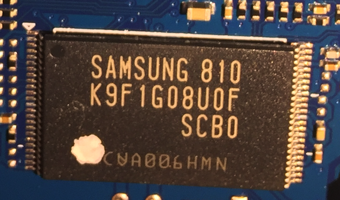
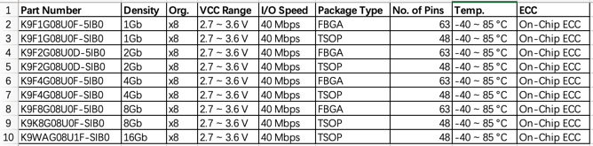

# 存储芯片

此处`方糖`的存储芯片是的`Nand Flash`：`Samsung K9F1G08U0F`

从电路板上：



看到了：

```bash
SAMSUNG 810
K9F1G08U0F
SCB0
CUA006HMN
```

然后通过研究搞清楚是：

[K9F1G08U0F](http://www.mt-system.ru/sites/default/files/docs/samsung/k9f1g08u0f_1.0.pdf)

## 三星`Nand Flash`存储芯片：`K9F1G08U0F`

* `K9F1G08U0F`
  * 基本介绍
    * K9F1G08U0F采用`128Mx8bit`，是`1Gb`的NAND闪存，备用32Mbit。
    * 该器件采用`3.3V VCC`封装。
    * 其NAND单元为固态应用市场提供最具成本效益的解决方案。
    * 可以在（`2K + 64`）字节页面上以典型的`400us`执行`编程`操作。
    * 并且可以在（`128K + 4K`）字节块上以典型的`4.5ms`执行`擦除`操作。
    * 数据寄存器中的数据可以每个字节`25ns`周期时间读出。
    * I/O引脚用作地址和数据输入/输出以及命令输入的端口。
    * 片上写入控制器可自动执行所有编程和擦除功能，包括脉冲重复（如果需要）以及内部验证和数据裕量。
  * 总结
    * `K9F1G08U0F`是大型非易失性存储应用的最佳解决方案
      * 例如`固态文件存储`和其他需要非易失性的便携式应用。
  * 参数
    * `Density`=`容量`：`1Gb`
    * `Org.`=`Organization`=`架构`：`x8`
    * `VCC Range`=`VCC 范围`：`2.7 ~ 3.6 V`
    * `I/O Speed`=`I/O速度`：`40 Mbps`
    * `Package Type`=`封装类型`：`TSOP`
    * `No. of Pins`=`针脚数目`：`48`
    * `Temp.`=`工作温度`：`-40 ~ 85 °C`
    * `ECC`=`ECC校验`：`On-Chip ECC`=`片上ECC`
* SCB0
  * `K9F1G08U0F-SCB0` 的`Temperature Under Bias`的Rating是`-10 to +125`
  * 对应其他的是：
    * `K9F1G08U0F-SxB0` 的`Temperature Under Bias`的Rating是`-40 to +125`
* 其他类似的型号
  * 

> #### info:: 关于`Nand Flash`的更多更专业的解释
> 详见之前教程：[【详解】如何编写Linux下Nand Flash驱动](https://www.crifan.com/files/doc/docbook/linux_nand_driver/release/html/linux_nand_driver.html)
