# 硬件拆解过程

此处介绍`天猫精灵`的`方糖`的硬件拆解过程。

拿到硬件，即天猫精力方糖的盒子：

正面：

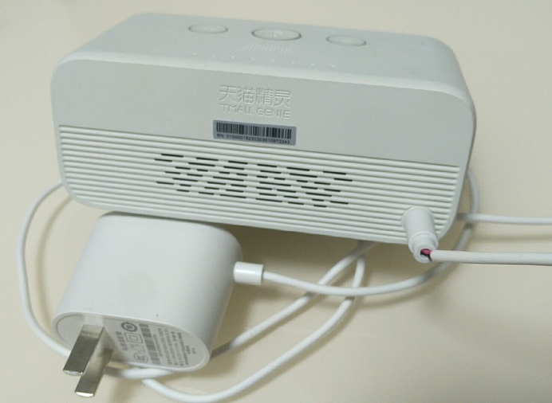

背面：

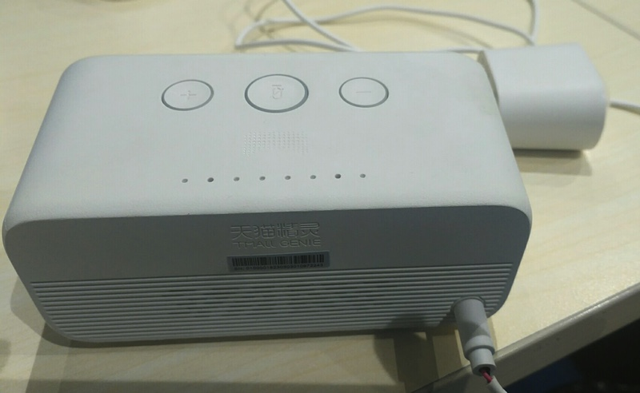

电源插头：

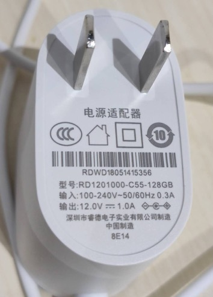

先去拆解出电路板。

背面没有看到螺丝。

去看看底部的一层软胶质的东西：

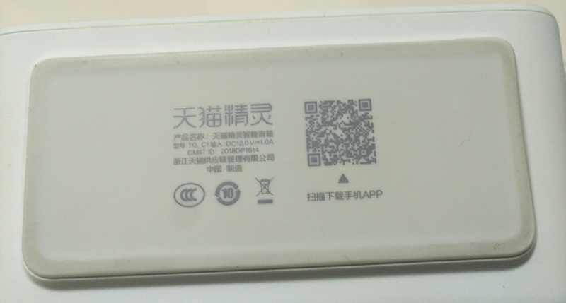

能否掀开。参考别人的：

> 这次拆解从正面的扬声器遮罩开始拆，注意不是底部的橡胶垫。

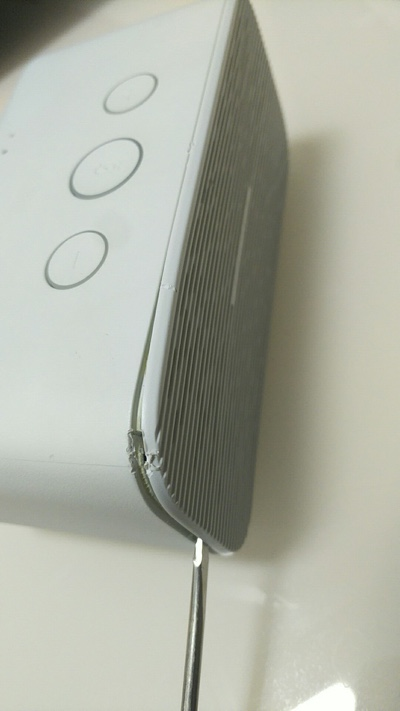

拆开了：

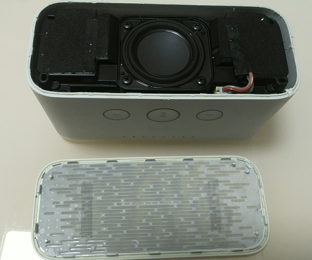

继续拆螺丝：

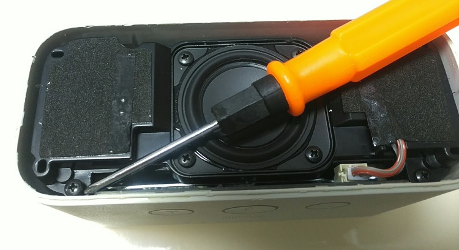

拆掉了4颗螺丝：

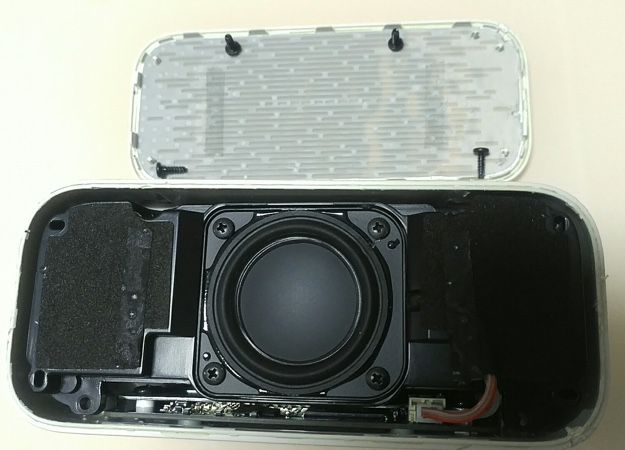

手拔掉插座：

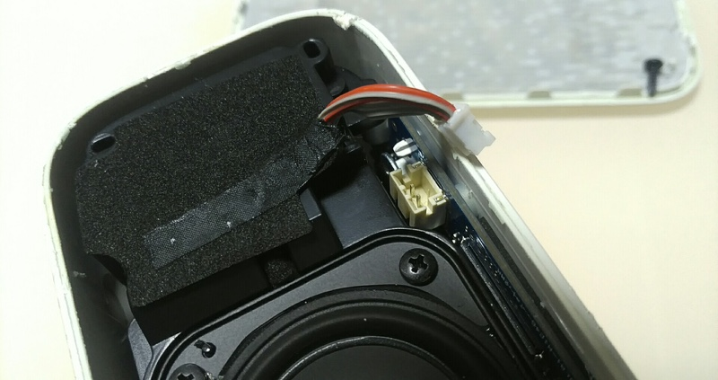

就可以拿下来了：

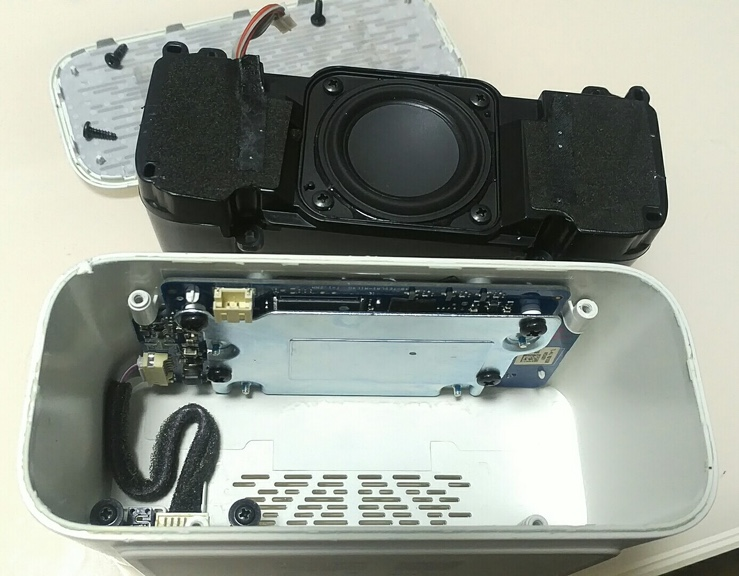

为了拆卸主电路板的螺丝，需要把说明的胶皮撕掉，漏出孔：

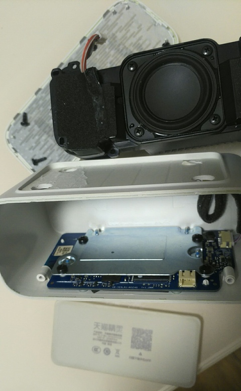

再用螺丝刀去卸电路板上的螺丝。

不过先要卸里面的螺丝：

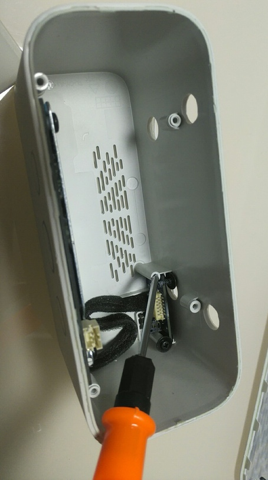

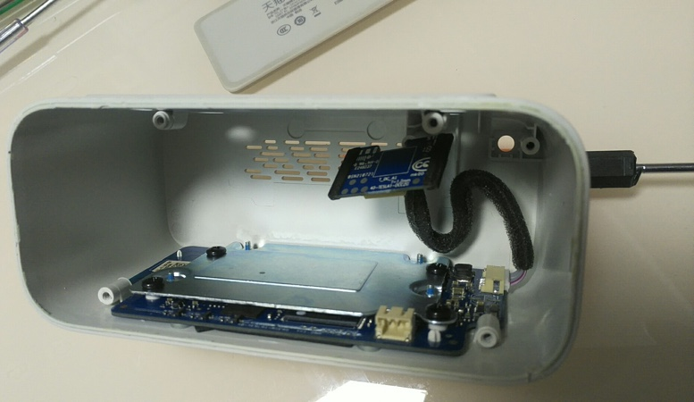

再去卸电路板上的螺丝：

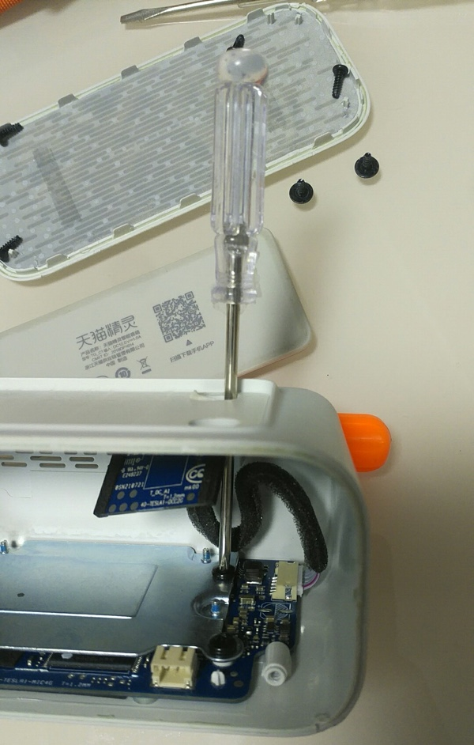

但是最后要耗很大的力气，里面有强力胶粘住的：

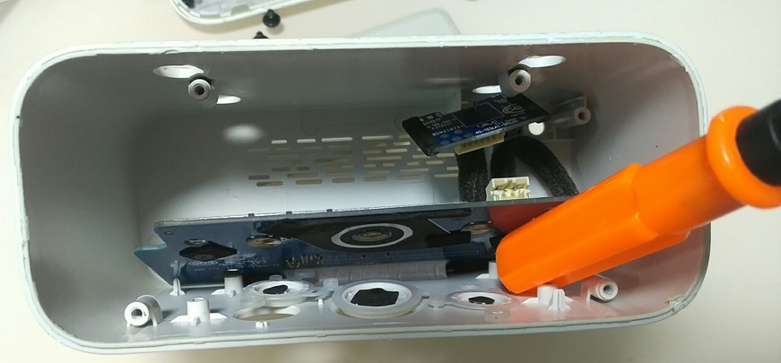

用力才能拽出来。最后终于弄出来了：

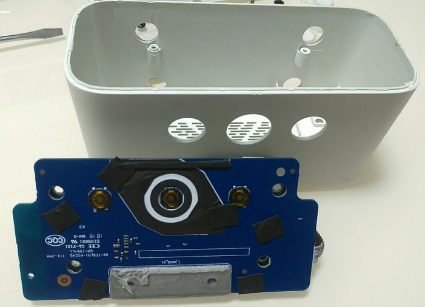

拆掉胶带，再拆螺丝：

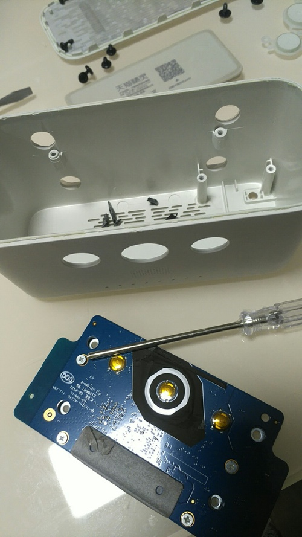

然后就可以拆出主板了：

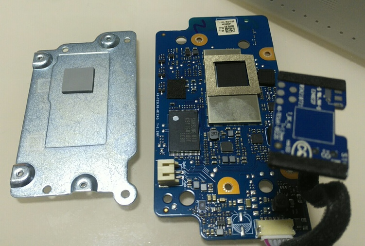

这就是主板：

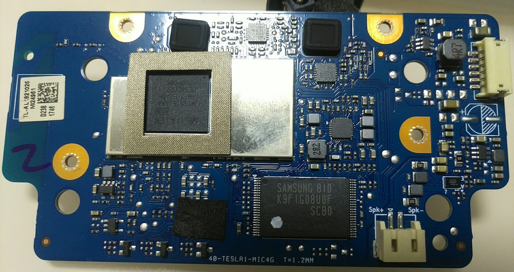

扬声器特写：

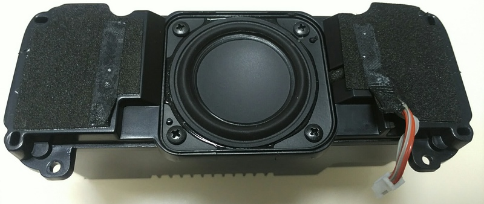

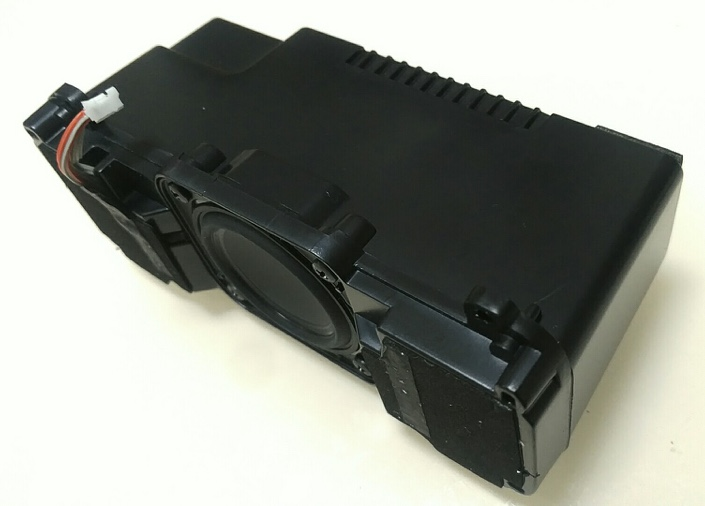

继续打开扬声器：

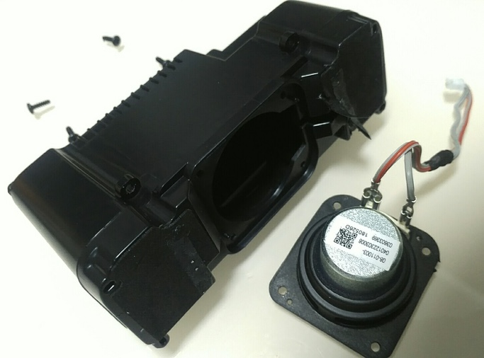

里面就是空的了：

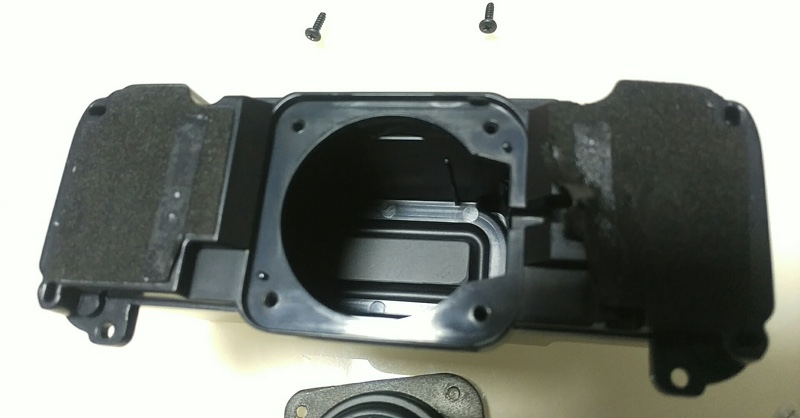
